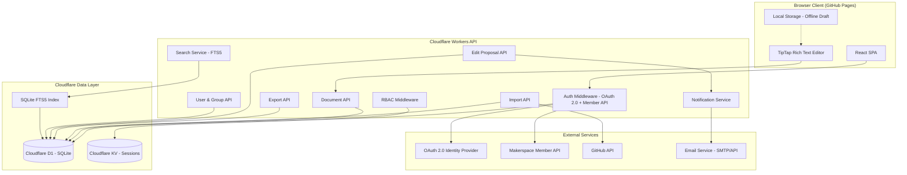
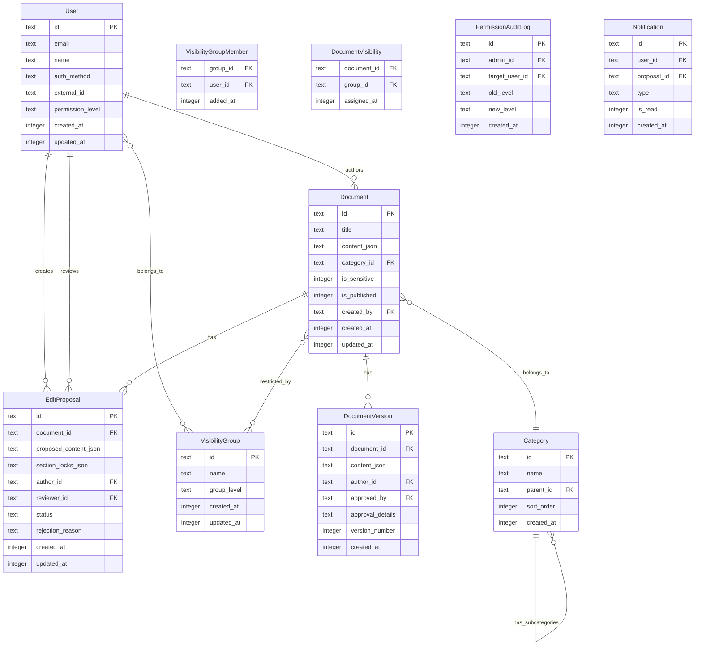

# Design Document: Makerspace Docs System

## Overview

The Makerspace Docs System is a web-based document management application that replaces a GitHub-based documentation workflow for a makerspace community. It provides rich-text editing, structured approval workflows, role-based access control, and group-based visibility — all behind an intuitive UI accessible to non-technical contributors.

The system is built as a React SPA (using TipTap for rich-text editing) hosted on GitHub Pages, with a Cloudflare Workers API backend, Cloudflare D1 (SQLite-based) for persistence, and Cloudflare KV for session storage. Authentication supports both OAuth 2.0 identity providers and the makerspace's existing member system API. The entire stack runs on free tiers.

### Key Design Decisions

- **TipTap Editor**: Chosen for the rich-text editor because it is built on ProseMirror, supports collaborative editing extensions, and has first-class Markdown import/export via `@tiptap/pm` utilities. This directly supports Requirements 1, 2, and 3.
- **GitHub Pages + Cloudflare Workers**: The SPA is deployed as static files on GitHub Pages (free). The API runs on Cloudflare Workers (free tier: 100k requests/day, 10ms CPU per request). This eliminates hosting costs entirely.
- **Cloudflare D1 (SQLite) + Drizzle ORM**: Chosen as the database because it is free, serverless, and supports SQLite FTS5 for full-text search. Document content is stored as JSON text in D1. D1 supports transactions needed for the approval workflow. Drizzle ORM provides TypeScript-first schema definitions with explicit D1 support, type-safe queries, and lightweight migrations.
- **Cloudflare KV for sessions**: Session tokens (from both OAuth and makerspace member login) are stored in Cloudflare KV with TTL-based expiry. KV's global edge distribution provides low-latency session lookups.
- **Unified internal document model**: Documents are stored in a structured JSON format (TipTap/ProseMirror JSON) that serves as the single source of truth. Markdown import and export are transformations to/from this format, enabling the round-trip property (Requirement 1.5). The `unified/remark` ecosystem handles Markdown ↔ ProseMirror JSON conversion.
- **Dual authentication**: Users can log in via OAuth 2.0 (Google, GitHub) or via the makerspace's existing member system API. The member API login returns a username-based session token; no permissions are derived from it — permissions are assigned manually by an Admin within the Docs_System (Requirement 7.6).
- **Event-driven notifications**: Edit proposal state changes emit events consumed by a notification service, decoupling the approval workflow from the notification delivery mechanism (email, in-app).
- **Hono framework**: Chosen as the Worker framework for its lightweight, edge-native design. Hono provides structured routing, middleware composition, and type-safe request/response handling — replacing raw `fetch` event handlers with a clean, Express-like API.
- **Vite + React**: Vite is the frontend build tool for fast HMR during development and optimized production builds. React (plain, no meta-framework) with React Router provides client-side routing for the SPA.
- **pnpm workspaces**: The project uses a pnpm monorepo with workspaces to share TypeScript types and utilities between the frontend SPA and the Cloudflare Worker backend.

### Technology Stack

| Layer | Technology | Notes |
|---|---|---|
| Package Manager | pnpm (workspaces) | Monorepo structure sharing types between frontend and worker |
| Language | TypeScript | Used across frontend, worker, and shared packages |
| Frontend Build | Vite | Fast HMR, optimized production builds |
| Frontend Framework | React + React Router | Plain React SPA with client-side routing |
| Styling | Tailwind CSS | Utility-first CSS; optionally shadcn/ui for pre-built components |
| Rich Text Editor | TipTap / ProseMirror | WYSIWYG editing with Markdown round-trip support |
| Worker Framework | Hono | Lightweight, edge-native routing and middleware |
| ORM | Drizzle ORM | TypeScript-first, explicit D1/SQLite support |
| Database | Cloudflare D1 (SQLite) | Serverless, free tier, FTS5 for full-text search |
| Session Storage | Cloudflare KV | TTL-based session expiry, edge-distributed |
| Markdown Processing | unified / remark | Markdown ↔ ProseMirror JSON conversion |
| Testing | Vitest + fast-check | Unit/integration tests + property-based tests |
| Deployment | GitHub Pages (SPA) + Cloudflare Workers (API) | Via GitHub Actions and wrangler CLI |
| CI | GitHub Actions | Build, test, and deploy pipelines |

## Architecture



### Request Flow

1. User authenticates via OAuth 2.0 or Makerspace Member API → session token stored in Cloudflare KV with TTL
2. All API requests pass through Auth Middleware (session lookup in KV) → RBAC Middleware (permission check against D1)
3. Document operations go through Document API → Cloudflare D1
4. Edit proposals trigger notifications via the Notification Service
5. Search queries use SQLite FTS5 virtual tables in D1

### Deployment

- **Frontend**: React SPA built and deployed to GitHub Pages via GitHub Actions. The SPA is configured to call the Cloudflare Workers API URL.
- **Backend**: Cloudflare Workers deployed via `wrangler`. D1 database and KV namespace are bound to the Worker.
- **Free tier limits**: Cloudflare Workers free tier provides 100,000 requests/day, 10ms CPU time per invocation, 5GB D1 storage, and 1GB KV storage. This is sufficient for a makerspace community.

## Components and Interfaces

### Frontend Components (React SPA on GitHub Pages)

| Component | Responsibility |
|---|---|
| `AuthProvider` | Manages dual login flow (OAuth 2.0 + Makerspace Member API), session tokens, and redirect on expiry (Req 7) |
| `RichTextEditor` | TipTap-based WYSIWYG editor with live preview, local storage draft persistence (Req 3) |
| `DocumentViewer` | Renders published document content in read-only mode |
| `ProposalDiffView` | Side-by-side diff display for edit proposal review (Req 4.3) |
| `NavigationSidebar` | Category/subcategory tree with expand/collapse, sensitive page indicators (Req 6.4, 8.6) |
| `SearchBar` | Full-text search input with result display (Req 6.2, 6.3) |
| `AdminPanel` | User management, group management, import/export controls, category configuration |

### Backend Services (Cloudflare Workers)

The backend is a single Cloudflare Worker using Hono for routing and middleware composition. D1 and KV bindings are available via Hono's typed `env` context.

| Service | Responsibility | Key Endpoints |
|---|---|---|
| `AuthMiddleware` | Validates session token from KV, enforces authentication, supports OAuth + Member API login (Req 7) | — (middleware) |
| `RBACMiddleware` | Enforces permission levels per route (Req 5) | — (middleware) |
| `DocumentService` | CRUD for documents, category assignment, sensitive page designation | `GET/POST/PUT/DELETE /api/documents` |
| `ImportService` | Fetches Markdown from GitHub, parses to internal format, generates import report (Req 1) | `POST /api/import` |
| `ExportService` | Converts internal format to Markdown, generates ZIP for bulk export (Req 2) | `GET /api/export/:id`, `POST /api/export/bulk` |
| `ProposalService` | Edit proposal lifecycle: create, review, approve, reject, conflict detection (Req 4) | `GET/POST/PUT /api/proposals` |
| `SearchService` | Full-text search over documents using SQLite FTS5 (Req 6) | `GET /api/search` |
| `NotificationService` | Sends email and in-app notifications on proposal events (Req 4.2, 8.3) | — (event-driven) |
| `UserService` | User CRUD, permission level assignment, audit logging (Req 5.6) | `GET/POST/PUT /api/users` |
| `GroupService` | Visibility group CRUD, membership management, document assignment (Req 9) | `GET/POST/PUT/DELETE /api/groups` |

### Key Interfaces

```typescript
// Document format conversion
interface MarkdownConverter {
  parseMarkdown(markdown: string): DocumentNode;
  toMarkdown(doc: DocumentNode): string;
}

// Import engine
interface ImportEngine {
  importFromGitHub(repoUrl: string): Promise<ImportReport>;
}

interface ImportReport {
  totalFiles: number;
  importedCount: number;
  failures: Array<{ filePath: string; reason: string }>;
  warnings: Array<{ filePath: string; content: string; reason: string }>;
}

// Edit proposal
interface ProposalService {
  create(documentId: string, changes: DocumentNode, authorId: string): Promise<EditProposal>;
  approve(proposalId: string, approverId: string): Promise<Document>;
  reject(proposalId: string, approverId: string, reason: string): Promise<EditProposal>;
  getDiff(proposalId: string): Promise<DiffResult>;
  checkConflicts(documentId: string, sectionIds: string[]): Promise<boolean>;
}

// Authentication (dual method)
interface AuthService {
  loginOAuth(provider: string, code: string): Promise<Session>;
  loginMember(credentials: { username: string; password: string }): Promise<Session>;
  validateSession(token: string): Promise<User | null>;
  logout(token: string): Promise<void>;
}

interface Session {
  token: string;
  userId: string;
  authMethod: 'oauth' | 'member';
  expiresAt: number;
}

// RBAC
interface AccessControl {
  checkPermission(userId: string, action: Action, resourceId?: string): Promise<boolean>;
  checkVisibility(userId: string, documentId: string): Promise<boolean>;
}

type Action = 'view' | 'edit' | 'propose' | 'approve' | 'reject' | 'admin';
type PermissionLevel = 'Viewer' | 'Editor' | 'Approver' | 'Admin';
type GroupLevel = 'Member' | 'Non_Member' | 'Team_Leader' | 'Manager' | 'Board_Member';
```


## Data Models

### Cloudflare D1 (SQLite) Schema



### SQLite FTS5 Virtual Table

Full-text search is implemented using SQLite FTS5, which is natively supported by Cloudflare D1:

```sql
CREATE VIRTUAL TABLE document_fts USING fts5(
    title,
    content_text,
    content='documents',
    content_rowid='rowid'
);
```

The `content_text` column stores a plain-text extraction of the ProseMirror JSON content. An application-level trigger (in the Worker) keeps the FTS index in sync when documents are created, updated, or deleted. Search queries use FTS5's `MATCH` operator with `bm25()` ranking for relevance ordering.

### Cloudflare KV Session Storage

Sessions are stored in Cloudflare KV with the session token as the key and a JSON value:

```json
{
  "userId": "abc-123",
  "authMethod": "oauth | member",
  "permissionLevel": "Editor",
  "expiresAt": 1700000000
}
```

KV entries use a TTL matching the session duration (e.g., 24 hours). On each request, the Auth Middleware reads the session from KV by token. Expired sessions are automatically evicted by KV's TTL mechanism.

### Key Data Constraints

- `EditProposal.status`: one of `draft`, `pending`, `approved`, `rejected`
- `User.permission_level`: one of `Viewer`, `Editor`, `Approver`, `Admin`
- `User.auth_method`: one of `oauth`, `member` — tracks how the user was created/last authenticated
- `User.external_id`: the OAuth provider's user ID or the makerspace member username
- `VisibilityGroup.group_level`: one of `Member`, `Non_Member`, `Team_Leader`, `Manager`, `Board_Member`
- `Document.content_json` stores TipTap/ProseMirror JSON as a TEXT column — the canonical internal format
- `EditProposal.section_locks_json` tracks which document sections are locked by this proposal (Req 4.6)
- `DocumentVersion` is append-only — versions are never deleted (Req 4.7)
- SQLite does not have native enum types; constraints are enforced at the application level via CHECK constraints or Worker validation
- Timestamps are stored as Unix epoch integers (SQLite has no native timestamp type)
- UUIDs are generated in the Worker (e.g., `crypto.randomUUID()`) and stored as TEXT

### Permission Hierarchy

Permissions are strictly hierarchical: Admin ⊃ Approver ⊃ Editor ⊃ Viewer. Each level inherits all permissions of the levels below it.

### Visibility Resolution

Document visibility is resolved as follows:
1. If the document has no `VisibilityGroup` assignments → fall back to standard RBAC (Req 9.6)
2. If the document has one or more `VisibilityGroup` assignments → user must belong to at least one of those groups (Req 9.5)
3. Admins can always view all documents regardless of group assignment


## Correctness Properties

*A property is a characteristic or behavior that should hold true across all valid executions of a system — essentially, a formal statement about what the system should do. Properties serve as the bridge between human-readable specifications and machine-verifiable correctness guarantees.*

### Property 1: Markdown round-trip

*For any* valid internal document node, converting it to Markdown and then parsing the Markdown back to an internal document node SHALL produce an equivalent document node.

**Validates: Requirements 1.5, 2.1, 2.3**

### Property 2: Import report accuracy

*For any* set of import results containing a mix of successful and failed file imports, the generated import report SHALL have `importedCount` equal to the number of successful imports, `failures.length` equal to the number of failed imports, and every failed file SHALL appear in the failures list with a non-empty reason.

**Validates: Requirements 1.3**

### Property 3: Graceful degradation on unparsable content

*For any* valid Markdown document with unparsable sections injected at arbitrary positions, the Import_Engine SHALL produce a document containing all parsable content from the original, and the unparsable sections SHALL appear in the warnings log with their file path and content.

**Validates: Requirements 1.4**

### Property 4: Edit proposal contains required fields

*For any* valid document and set of proposed changes submitted by an Editor, the created Edit_Proposal SHALL contain the proposed content, the author's identity, and a timestamp, and all three fields SHALL be non-null.

**Validates: Requirements 4.1**

### Property 5: Proposal state machine transitions

*For any* pending Edit_Proposal, approving it SHALL result in the document content matching the proposed content and the version number incrementing by one. Rejecting it SHALL record the provided rejection reason on the proposal and leave the document content unchanged.

**Validates: Requirements 4.4, 4.5**

### Property 6: Section conflict detection

*For any* document with a pending Edit_Proposal that locks a set of sections, attempting to create another Edit_Proposal that overlaps any of those locked sections SHALL be rejected. Creating a proposal on non-overlapping sections SHALL succeed.

**Validates: Requirements 4.6**

### Property 7: Version history completeness

*For any* document that has undergone a sequence of N approved edit proposals, the version history SHALL contain exactly N+1 entries (including the initial version), and each entry SHALL have a non-null author, timestamp, and approval details.

**Validates: Requirements 4.7**

### Property 8: RBAC permission hierarchy

*For any* user and any action, the system SHALL enforce: Viewers can only perform `view` actions; Editors can perform `view`, `edit`, and `propose` actions; Approvers can perform all Editor actions plus `approve` and `reject`; Admins can perform all actions. No role SHALL be permitted to perform actions above its level.

**Validates: Requirements 5.2, 5.3, 5.4, 5.5**

### Property 9: Permission change immediate effect

*For any* user whose permission level is changed by an Admin, the very next access check for that user SHALL reflect the new permission level, not the old one. An audit log entry SHALL be created containing the Admin's identity, the target user, the old level, the new level, and a timestamp.

**Validates: Requirements 5.6**

### Property 10: Notification routing

*For any* Edit_Proposal on a standard (non-sensitive) document, all Approvers assigned to the document's category SHALL be in the notification recipient list. *For any* Edit_Proposal on a Sensitive_Page, only users with Admin permission level SHALL be in the notification recipient list, and no non-Admin Approvers SHALL be included.

**Validates: Requirements 4.2, 8.3**

### Property 11: Search result completeness and ordering

*For any* search query that matches at least one document, every result in the returned list SHALL contain a document title, category, a content snippet that includes the matched text, and a last-modified date. Results SHALL be ordered by relevance score in descending order.

**Validates: Requirements 6.2, 6.3**

### Property 12: Sensitive page approval routing

*For any* Edit_Proposal on a document marked as a Sensitive_Page, only users with Admin permission level SHALL be able to approve or reject the proposal. *For any* document where the Sensitive_Page designation is removed, subsequent Edit_Proposals SHALL be approvable by users with Approver or Admin permission level.

**Validates: Requirements 8.2, 8.5**

### Property 13: Visibility group access resolution

*For any* document assigned to one or more Visibility_Groups and any user, the user SHALL have read access if and only if they belong to at least one of the assigned groups (or are an Admin). *For any* document with no Visibility_Group assignments, access SHALL follow the standard RBAC rules from Requirement 5.

**Validates: Requirements 9.3, 9.5, 9.6**

### Property 14: Group creation validation

*For any* Visibility_Group creation request, the system SHALL reject the request if any of the following are missing: group name, group level, or at least one member. The system SHALL accept the request if all three are provided with valid values.

**Validates: Requirements 9.2**

### Property 15: Group membership change immediate effect

*For any* user added to or removed from a Visibility_Group, the very next visibility check for that user on documents restricted to that group SHALL reflect the updated membership.

**Validates: Requirements 9.7**

### Property 16: Session reflects assigned permission level

*For any* user with an assigned permission level in the Docs_System, authenticating via either OAuth or the Makerspace Member API SHALL produce a session whose permission level matches the user's assigned level in the Docs_System.

**Validates: Requirements 7.3**

### Property 17: Member login does not derive permissions

*For any* user authenticating via the Makerspace Member API, regardless of the data returned by the member system API, the session permission level SHALL be determined solely by the user's record in the Docs_System. No field from the member API response SHALL influence the assigned permission level.

**Validates: Requirements 7.6**

### Property 18: Expired sessions are denied

*For any* session token whose expiry timestamp is in the past, all API access attempts using that token SHALL be denied and the system SHALL require re-authentication.

**Validates: Requirements 7.4**


## Error Handling

### Import Errors

| Error | Handling | User Feedback |
|---|---|---|
| Invalid GitHub URL | Reject import request with validation error | "Invalid repository URL. Please provide a valid GitHub repository URL." |
| GitHub API rate limit / auth failure | Retry with exponential backoff (3 attempts), then fail | "Unable to access the repository. Please check your credentials and try again." |
| Unparsable Markdown section | Log warning, skip section, continue import | Included in import report under warnings |
| File too large | Skip file, log as failure | Listed in import report failures with size limit reason |
| Network timeout during import | Retry individual file fetch (3 attempts), then log as failure | Listed in import report failures |

### Document Operations

| Error | Handling | User Feedback |
|---|---|---|
| Concurrent edit conflict (section locked) | Reject proposal creation | "This section is currently being reviewed in another proposal. Please wait for it to be resolved." |
| Save failure (network) | Local storage draft preserved, retry on reconnect | "Changes saved locally. They will sync when your connection is restored." |
| Document not found | Return 404 | "Document not found." |
| Unauthorized access | Return 403 | "You do not have permission to perform this action." |
| Visibility group access denied | Return 403 with specific message | "You do not have permission to view this document." |

### Authentication Errors

| Error | Handling | User Feedback |
|---|---|---|
| OAuth provider unavailable | Display error page with retry option | "Authentication service is temporarily unavailable. Please try again." |
| Makerspace Member API unavailable | Display error page with retry option | "The makerspace member system is temporarily unavailable. Please try again or use an alternative login method." |
| Invalid makerspace member credentials | Return 401 | "Invalid username or password. Please check your credentials." |
| Session expired | Clear session from KV, redirect to login | Redirect to login page with "Session expired" message |
| Invalid session token | Clear session from KV, redirect to login | Redirect to login page |
| KV session lookup failure | Retry once, then treat as unauthenticated | Redirect to login page |

### Validation Errors

| Error | Handling | User Feedback |
|---|---|---|
| Empty group name / missing group level / no members | Reject with 400 | Field-specific validation messages |
| Invalid permission level | Reject with 400 | "Invalid permission level. Must be one of: Viewer, Editor, Approver, Admin." |
| Empty document title | Reject with 400 | "Document title is required." |

## Testing Strategy

### Unit Tests (Vitest, Example-Based)

Unit tests cover specific scenarios, edge cases, and integration points:

- **Rich Text Editor configuration**: Verify all required TipTap extensions are loaded (Req 3.1)
- **Live preview rendering**: Verify preview updates on content change (Req 3.2)
- **Draft save format**: Verify save produces correct internal format (Req 3.3)
- **Unauthenticated redirect**: Verify 401 → redirect to auth page (Req 5.7)
- **Category CRUD**: Verify category/subcategory creation and document assignment (Req 6.1)
- **Navigation sidebar**: Verify sidebar renders category tree with sensitive indicators (Req 6.4, 8.6)
- **Sensitive page designation**: Verify admin can toggle sensitive flag (Req 8.1)
- **Sensitive page read-only for Approvers**: Verify Approvers see read-only view with notice (Req 8.4)
- **Group management admin view**: Verify admin endpoint returns complete group data (Req 9.8)
- **Session expiry redirect**: Verify expired KV sessions require re-authentication (Req 7.4)
- **Login page dual options**: Verify login page presents both OAuth and Makerspace Member login options (Req 7.1, 7.2)
- **FTS5 index sync**: Verify document_fts table is updated when documents are created/updated/deleted

### Integration Tests (Vitest)

Integration tests verify external service interactions and end-to-end flows:

- **GitHub import flow**: Mock GitHub API, verify file retrieval and import pipeline (Req 1.1)
- **Bulk export ZIP**: Verify ZIP structure preserves folder hierarchy (Req 2.2)
- **Offline draft persistence**: Simulate network loss, verify local storage and recovery (Req 3.4)
- **OAuth authentication flow**: Mock OAuth provider, verify session creation and KV storage (Req 7.1, 7.5)
- **Makerspace Member API login flow**: Mock Member API, verify credential validation, session token creation, and KV storage (Req 7.2)
- **Diff display**: Verify side-by-side diff renders correctly for known change sets (Req 4.3)
- **Full-text search via FTS5**: Verify search returns results within 2 seconds for 10,000 documents using D1 FTS5 (Req 6.2)
- **D1 transaction integrity**: Verify proposal approval atomically updates document and creates version entry
- **Cloudflare Worker routing**: Verify all Hono routes dispatch correctly in the Worker

### Property-Based Tests (Vitest + fast-check)

Property-based tests use `fast-check` (JavaScript/TypeScript PBT library) with Vitest as the test runner and a minimum of 100 iterations per property. Each test references its design document property.

| Property | Test Description | Tag |
|---|---|---|
| Property 1 | Generate random document nodes, verify `parse(toMarkdown(node))` ≡ `node` | Feature: makerspace-docs-system, Property 1: Markdown round-trip |
| Property 2 | Generate random import result sets, verify report counts and failure listings | Feature: makerspace-docs-system, Property 2: Import report accuracy |
| Property 3 | Generate valid Markdown with injected bad sections, verify parsable content preserved and warnings logged | Feature: makerspace-docs-system, Property 3: Graceful degradation on unparsable content |
| Property 4 | Generate random documents and changes, verify proposal has author, content, timestamp | Feature: makerspace-docs-system, Property 4: Edit proposal contains required fields |
| Property 5 | Generate random proposals, approve/reject, verify document state and rejection reason | Feature: makerspace-docs-system, Property 5: Proposal state machine transitions |
| Property 6 | Generate random section lock sets, verify overlapping proposals blocked, non-overlapping allowed | Feature: makerspace-docs-system, Property 6: Section conflict detection |
| Property 7 | Generate random approval sequences, verify version history length and field completeness | Feature: makerspace-docs-system, Property 7: Version history completeness |
| Property 8 | Generate random (role, action) pairs, verify permission grant/deny matches hierarchy | Feature: makerspace-docs-system, Property 8: RBAC permission hierarchy |
| Property 9 | Generate random permission changes, verify next access check reflects new level and audit log exists | Feature: makerspace-docs-system, Property 9: Permission change immediate effect |
| Property 10 | Generate random proposals on standard/sensitive docs, verify notification recipients | Feature: makerspace-docs-system, Property 10: Notification routing |
| Property 11 | Generate random documents and queries, verify result fields and relevance ordering | Feature: makerspace-docs-system, Property 11: Search result completeness and ordering |
| Property 12 | Generate random proposals on sensitive/non-sensitive docs, verify approval permissions | Feature: makerspace-docs-system, Property 12: Sensitive page approval routing |
| Property 13 | Generate random documents, groups, and users, verify access resolution logic | Feature: makerspace-docs-system, Property 13: Visibility group access resolution |
| Property 14 | Generate random group creation inputs with missing/present fields, verify validation | Feature: makerspace-docs-system, Property 14: Group creation validation |
| Property 15 | Generate random membership changes, verify next visibility check reflects update | Feature: makerspace-docs-system, Property 15: Group membership change immediate effect |
| Property 16 | Generate random users with random permission levels and auth methods, verify session permission matches Docs_System assignment | Feature: makerspace-docs-system, Property 16: Session reflects assigned permission level |
| Property 17 | Generate random member API responses with extra fields, verify session permission comes only from Docs_System user record | Feature: makerspace-docs-system, Property 17: Member login does not derive permissions |
| Property 18 | Generate random session tokens with expired timestamps, verify all access attempts are denied | Feature: makerspace-docs-system, Property 18: Expired sessions are denied |

