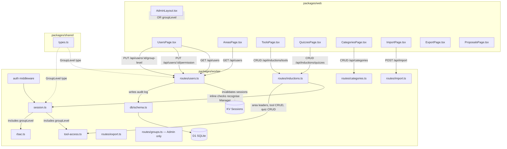

# Design Document: Manager Role Expansion

## Overview

This feature introduces a dual-permission model by adding a `group_level` column to the `users` table, independent of the existing `permission_level` column. The `groupLevel` field represents an organisational role (Member, Non_Member, Team_Leader, Manager, Board_Member) that controls admin-panel access and training-portal privileges.

Note: `groupLevel` does NOT affect document visibility. Visibility is driven by explicit group membership records. The Team_Leader and Board_Member values are organisational labels only — this feature introduces no new behaviour for those values beyond storing them.

The key design decision is that `permissionLevel` and `groupLevel` are orthogonal axes: `permissionLevel` gates document/system RBAC (Viewer → Admin), while `groupLevel` gates organisational privileges. A Manager (groupLevel) gains broad admin-panel access — Users (with restrictions), Categories, Proposals, Import, Export, and the full Training Portal (Areas, Tools, Quizzes) — but cannot access Visibility Groups, create/delete users, edit user profiles (name/email/username), promote anyone to Admin/Manager/Board_Member, or edit Admin, Manager, or Board_Member users.

Changes span five layers:
1. **Database** — new `group_level` column on `users`, new `group_level_audit_log` table, Drizzle schema updates
2. **Session** — `SessionData` includes `groupLevel`; `createSession` accepts it; reverse-lookup KV key for session invalidation on groupLevel change
3. **Middleware** — `requireToolAccess`, `requireAreaAccess`, and `requireTrainer` recognise Manager groupLevel; new `requireAdminOrManager` helper used across many routes
4. **API routes** — new `PUT /api/users/:id/group-level` endpoint; `PUT /api/users/:id/permission` relaxed to admit Managers (with boundary rules); `GET /api/users` relaxed to admit Managers; categories, import, tool CRUD, quiz CRUD, area CRUD all relaxed from `requireRole("Admin")` to `requireAdminOrManager()`; inline Admin checks in induction handlers updated
5. **UI** — AdminLayout relaxed to admit Managers with route-level guard on `/admin/groups`; UsersPage shows both columns with Manager-specific restrictions (no create/delete, restricted dropdowns); ToolsPage and QuizzesPage fully accessible to Managers

## Architecture



The flow for a groupLevel change:
1. Admin or Manager calls `PUT /api/users/:id/group-level` with `{ groupLevel: "Manager" }`
2. New `requireAdminOrManager()` middleware checks `session.permissionLevel === "Admin"` OR `session.groupLevel === "Manager"`
3. Route handler validates the value, enforces Manager edit boundary rules (see below), updates the user row and writes an audit log entry in a single transaction, invalidates the target user's active sessions, then returns the updated user

Manager edit boundary rules (enforced in the route handler, not in middleware):
- A Manager CANNOT change their own groupLevel (self-edit blocked)
- A Manager CANNOT set any user's groupLevel to "Manager" or "Board_Member" (only Admins can promote to these levels)
- A Manager CANNOT change the groupLevel of a user whose current groupLevel is "Manager" or "Board_Member" (cannot demote peers/superiors)
- A Manager CANNOT change the groupLevel of a user whose permissionLevel is "Admin"
- Admins have no boundary restrictions

The flow for a Manager permissionLevel change:
1. Manager calls `PUT /api/users/:id/permission` with `{ permissionLevel: "Editor" }`
2. `requireAdminOrManager()` middleware admits the request
3. Route handler enforces Manager boundary rules:
   - Cannot set permissionLevel to "Admin"
   - Cannot edit users whose current permissionLevel is "Admin"
   - Cannot edit users whose current groupLevel is "Board_Member"
   - Cannot edit users whose current groupLevel is "Manager"
4. Updates the user row, writes audit log, invalidates target user's active sessions, returns updated user

The flow for Manager training-portal access:
1. Manager calls any trainer/tool/area route
2. Existing middleware (`requireToolAccess`, `requireAreaAccess`, `requireTrainer`) now checks `session.groupLevel === "Manager"` as an early-exit alongside the existing `session.permissionLevel === "Admin"` check
3. If Manager, access is granted without DB lookups for assignments

## Components and Interfaces

### Modified: `SessionData` (packages/worker/src/auth/session.ts)

```typescript
export interface SessionData {
  userId: string;
  authMethod: AuthMethod;
  permissionLevel: PermissionLevel;
  groupLevel: GroupLevel;       // NEW — defaults to "Member" if null/missing
  username: string | null;
  expiresAt: number;
}
```

`createSession` gains a `groupLevel` parameter (defaulting to `"Member"`). `getSession` applies a fallback: if the parsed JSON has no `groupLevel` field (pre-migration sessions), it defaults to `"Member"`.

### New: Session Invalidation (packages/worker/src/auth/session.ts)

When a user's `groupLevel` or `permissionLevel` changes, all their active sessions must be invalidated so the new value takes effect immediately (critical for demotions).

**Reverse-lookup key**: When `createSession` is called, it also stores a reverse-lookup entry in KV: `user-sessions:{userId}` → JSON array of session tokens, with the same 24h TTL as sessions. When invalidation is needed, the system reads this key, deletes each session token from KV, then clears the reverse-lookup key.

```typescript
export async function invalidateUserSessions(
  kv: KVNamespace,
  userId: string,
): Promise<void> {
  const key = `user-sessions:${userId}`;
  const raw = await kv.get(key);
  if (raw) {
    const tokens: string[] = JSON.parse(raw);
    await Promise.all(tokens.map((t) => kv.delete(t)));
    await kv.delete(key);
  }
}
```

`createSession` is updated to append the new token to the reverse-lookup list (with same TTL). `deleteSession` (logout) is updated to remove the token from the reverse-lookup list.

**Cleanup rules for `user-sessions:{userId}`**:
- On natural session expiry: stale tokens remain in the list but are harmless (KV auto-evicts the session data; the token reference becomes a no-op delete). The list itself auto-cleans via its 24h TTL.
- On logout: remove the token from the reverse-lookup list.
- On invalidation: delete all tokens and clear the list.

### Modified: `requireToolAccess` (packages/worker/src/middleware/tool-access.ts)

Add an early-exit after the Admin check:

```typescript
if (session.groupLevel === "Manager") {
  await next();
  return;
}
```

Same pattern for `requireAreaAccess`.

### Modified: `requireTrainer` (packages/worker/src/middleware/rbac.ts)

Add an early-exit after the Admin check:

```typescript
if (session.groupLevel === "Manager") {
  await next();
  return;
}
```

### New: `requireAdminOrManager` middleware (packages/worker/src/middleware/rbac.ts)

```typescript
export function requireAdminOrManager() {
  return createMiddleware<Env>(async (c, next) => {
    const session = c.get("session");
    if (session.permissionLevel === "Admin" || session.groupLevel === "Manager") {
      await next();
      return;
    }
    return c.json({ error: "Insufficient permissions" }, 403);
  });
}
```

Used by all routes that need to admit both Admins and Managers (see route table below).

### Route Guard Changes — Complete Table

The following table lists every backend route that changes from `requireRole("Admin")` to `requireAdminOrManager()`, plus routes that remain Admin-only:

| Route | File | Current Guard | New Guard | Notes |
|-------|------|---------------|-----------|-------|
| `GET /api/users` | users.ts | `requireRole("Admin")` | `requireAdminOrManager()` | Managers see user list for Users page + trainer/leader dialogs |
| `PUT /api/users/:id/permission` | users.ts | `requireRole("Admin")` | `requireAdminOrManager()` | Manager boundary rules enforced in handler |
| `PUT /api/users/:id` (edit name/email/username) | users.ts | `requireRole("Admin")` | `requireRole("Admin")` — **unchanged** | Profile editing remains Admin-only |
| `POST /api/users` (create) | users.ts | `requireRole("Admin")` | `requireRole("Admin")` — **unchanged** | Managers cannot create users |
| `DELETE /api/users/:id` | users.ts | `requireRole("Admin")` | `requireRole("Admin")` — **unchanged** | Managers cannot delete users |
| `POST /api/categories` | categories.ts | `requireRole("Admin")` | `requireAdminOrManager()` | Full category CRUD for Managers |
| `PUT /api/categories/:id` | categories.ts | `requireRole("Admin")` | `requireAdminOrManager()` | |
| `DELETE /api/categories/:id` | categories.ts | `requireRole("Admin")` | `requireAdminOrManager()` | |
| `POST /api/import` | import.ts | `requireRole("Admin")` | `requireAdminOrManager()` | Managers can import |
| `POST /api/import/zip` | import.ts | `requireRole("Admin")` | `requireAdminOrManager()` | Managers can import ZIP |
| `POST /inductions/tools` | inductions.ts | `requireRole("Admin")` | `requireAdminOrManager()` | Full tool CRUD for Managers |
| `PUT /inductions/tools/:id` | inductions.ts | `requireRole("Admin")` | `requireAdminOrManager()` | |
| `DELETE /inductions/tools/:id` | inductions.ts | `requireRole("Admin")` | `requireAdminOrManager()` | |
| `POST /inductions/quizzes` | inductions.ts | `requireRole("Admin")` | `requireAdminOrManager()` | Full quiz CRUD for Managers |
| `PUT /inductions/quizzes/:id` | inductions.ts | `requireRole("Admin")` | `requireAdminOrManager()` | |
| `POST /inductions/quizzes/:id/publish` | inductions.ts | `requireRole("Admin")` | `requireAdminOrManager()` | |
| `POST /inductions/quizzes/:id/archive` | inductions.ts | `requireRole("Admin")` | `requireAdminOrManager()` | |
| `POST /inductions/quizzes/:id/questions` | inductions.ts | `requireRole("Admin")` | `requireAdminOrManager()` | |
| `PUT /inductions/quizzes/:quizId/questions/:questionId` | inductions.ts | `requireRole("Admin")` | `requireAdminOrManager()` | |
| `DELETE /inductions/quizzes/:quizId/questions/:questionId` | inductions.ts | `requireRole("Admin")` | `requireAdminOrManager()` | |
| `POST /inductions/quizzes/import` | inductions.ts | `requireRole("Admin")` | `requireAdminOrManager()` | |
| `POST /inductions/areas` | inductions.ts | `requireRole("Admin")` | `requireAdminOrManager()` | Full area CRUD for Managers |
| `DELETE /inductions/areas/:id` | inductions.ts | `requireRole("Admin")` | `requireAdminOrManager()` | |
| `PUT /inductions/areas/:id/leaders` | inductions.ts | `requireRole("Admin")` | `requireAdminOrManager()` | Managers assign area leaders |
| All `/api/groups/*` routes | groups.ts | `requireRole("Admin")` | `requireRole("Admin")` — **unchanged** | Visibility Groups remain Admin-only |

### Modified: Inline Admin Checks in Induction Route Handlers (packages/worker/src/routes/inductions.ts)

Several induction routes have hard-coded `session.permissionLevel === "Admin"` / `!== "Admin"` checks **inside the handler body** (not in middleware). These must be updated to also recognise `session.groupLevel === "Manager"`. The complete list:

| Route | Line | Current Check | Change Required |
|-------|------|---------------|-----------------|
| `POST /trainer/tools/:toolId/mark-trained/:userId` | ~1734 | `if (session.permissionLevel !== "Admin")` — falls through to area-leader/trainer DB checks | Change to `if (session.permissionLevel !== "Admin" && session.groupLevel !== "Manager")` so Managers bypass the assignment check |
| `POST /signoff` | ~1823 | `if (session.permissionLevel !== "Admin")` — falls through to area-leader/trainer DB checks | Change to `if (session.permissionLevel !== "Admin" && session.groupLevel !== "Manager")` so Managers bypass the assignment check |
| `GET /trainer/my-tools` | ~2272 | `if (session.permissionLevel === "Admin")` — returns all tools only for Admin | Change to `if (session.permissionLevel === "Admin" \|\| session.groupLevel === "Manager")` so Managers also see all tools |

**Rationale**: Updating middleware alone (`requireTrainer`) is insufficient because these routes perform a second, inline authorisation check in the handler body. Without updating these checks, Managers would pass the middleware gate but then be denied (or see a restricted tool list) by the handler logic.

### New: `PUT /api/users/:id/group-level` (packages/worker/src/routes/users.ts)

```typescript
usersApp.put("/:id/group-level", requireAdminOrManager(), async (c) => {
  // 1. Validate groupLevel value
  // 2. Look up target user (404 if missing)
  // 3. Enforce Manager edit boundary rules:
  //    - Manager cannot edit self
  //    - Manager cannot promote to Manager or Board_Member
  //    - Manager cannot demote users who are Manager or Board_Member
  //    - Manager cannot edit users with permissionLevel "Admin"
  //    (Admins skip all boundary checks)
  // 4. In a single D1 batch/transaction:
  //    a. Update group_level column
  //    b. Insert audit log row into group_level_audit_log
  // 5. Invalidate target user's active sessions (KV)
  // 6. Return updated user
});
```

### Modified: `PUT /api/users/:id/permission` (packages/worker/src/routes/users.ts)

Change from `requireRole("Admin")` to `requireAdminOrManager()`. Add Manager boundary rules in the handler:

```typescript
// If caller is Manager (not Admin), enforce boundaries:
if (session.permissionLevel !== "Admin" && session.groupLevel === "Manager") {
  // Cannot set permissionLevel to "Admin"
  if (newLevel === "Admin") {
    return c.json({ error: "Only Admins can promote to Admin." }, 403);
  }
  // Cannot edit users who are currently Admin
  if (targetUser.permissionLevel === "Admin") {
    return c.json({ error: "Only Admins can change Admin users' permissions." }, 403);
  }
  // Cannot edit users who are Board_Member
  if (targetUser.groupLevel === "Board_Member") {
    return c.json({ error: "Only Admins can change Board Member users' permissions." }, 403);
  }
  // Cannot edit users who are Manager (groupLevel)
  if (targetUser.groupLevel === "Manager") {
    return c.json({ error: "Only Admins can change Manager users' permissions." }, 403);
  }
}
// After updating the user row and writing audit log:
// Invalidate target user's active sessions so the new permissionLevel takes effect immediately
await invalidateUserSessions(c.env.SESSIONS, targetUser.id);
```

### Modified: `AdminLayout.tsx` (packages/web/src/pages/admin/AdminLayout.tsx)

The current guard (`if (user?.permissionLevel !== "Admin") return <Navigate to="/" />`) blocks all non-Admins. This must be relaxed:

```typescript
const isAdmin = user?.permissionLevel === "Admin";
const isManager = user?.groupLevel === "Manager";

if (!isAdmin && !isManager) {
  return <Navigate to="/" replace />;
}
```

**Sidebar sections for Managers** — Managers see all sections except Visibility Groups:

```typescript
const sections = [
  {
    label: "General",
    tabs: [
      { to: "/admin/users", label: "Users" },
    ],
  },
  {
    label: "Docs Portal",
    tabs: [
      { to: "/admin/categories", label: "Categories" },
      { to: "/admin/proposals", label: "Proposals" },
      // Only show Visibility Groups for Admins
      ...(isAdmin ? [{ to: "/admin/groups", label: "Visibility Groups" }] : []),
      { to: "/admin/import", label: "Import" },
      { to: "/admin/export", label: "Export" },
    ],
  },
  {
    label: "Training Portal",
    tabs: [
      { to: "/admin/areas", label: "Areas" },
      { to: "/admin/tools", label: "Tools" },
      { to: "/admin/quizzes", label: "Quizzes" },
    ],
  },
];
```

**Route-level guard for `/admin/groups`**: In addition to hiding the sidebar link, the AdminLayout must implement a systematic route allowlist for Managers. Rather than special-casing individual routes, the layout validates the current path against a Manager-valid route list:

```typescript
// Manager-valid route allowlist
const MANAGER_ALLOWED_ROUTES = [
  "/admin/users",
  "/admin/categories",
  "/admin/proposals",
  "/admin/import",
  "/admin/export",
  "/admin/areas",
  "/admin/tools",
  "/admin/quizzes",
];

// In AdminLayout — after confirming user is Manager (not Admin)
if (!isAdmin) {
  const currentPath = location.pathname;
  const isAllowed = MANAGER_ALLOWED_ROUTES.some(
    (route) => currentPath === route || currentPath.startsWith(route + "/")
  );
  if (!isAllowed) {
    return <Navigate to="/admin/users" replace />;
  }
}
```

This prevents Managers from accessing any `/admin/*` route not in the allowlist (currently only `/admin/groups`) via direct URL navigation, and is future-proof — new Admin-only routes are blocked by default unless explicitly added to the allowlist.

### Modified: `UsersPage.tsx` (packages/web/src/pages/admin/UsersPage.tsx)

This page is now accessible to both Admins and Managers. Changes:

- `UserRow` interface gains `groupLevel: GroupLevel`
- Table gets a new "Group Level" column with a `<select>` dropdown
- Create-user form gains a Group Level dropdown defaulting to "Member"
- Reference section expanded with Group Level descriptions
- **Manager-specific restrictions**:
  - Hide "Create User" button and "Delete" buttons for Managers
  - A user is PROTECTED from Manager edits if ANY of: their permissionLevel is "Admin", their groupLevel is "Manager", or their groupLevel is "Board_Member". For protected users, both the Permission_Level and Group_Level dropdowns are disabled.
  - For non-protected users, the Permission_Level dropdown shows Viewer/Editor/Approver (no Admin option). The Group_Level dropdown shows Member/Non_Member/Team_Leader (no Manager/Board_Member options).
  - Profile edit controls (name, email, username) are NOT shown to Managers — profile editing remains Admin-only.

### Modified: `ToolsPage.tsx` (packages/web/src/pages/admin/ToolsPage.tsx)

Managers now have full CRUD access. The trainer assignment dialog fetches `GET /api/users` (now admits Managers). No read-only restrictions — Managers can create, edit, delete tools and manage trainers.

### Modified: `QuizzesPage.tsx` (packages/web/src/pages/admin/QuizzesPage.tsx)

Managers now have full CRUD access. No read-only restrictions — Managers can create, edit, publish, archive quizzes and manage questions.

### Modified: `AreasPage.tsx` (packages/web/src/pages/admin/AreasPage.tsx)

Managers now have full CRUD access to areas. The "Manage Leaders" dialog fetches `GET /api/users` (now admits Managers). No read-only restrictions — Managers can create, edit, delete areas and manage leaders.

### Proposals Access

Proposals routes are already Viewer+ for listing (`GET /proposals`) and Approver+ for approve/reject. The admin ProposalsPage is a management view. Managers access it through the admin sidebar. No backend changes needed for proposals — the existing route guards already admit users at the appropriate permission levels. The only change is making the sidebar link visible to Managers.

**Design intent**: The Proposals page is for visibility only. Approve/reject actions are gated by `permissionLevel` (Approver+). Managers with lower `permissionLevel` simply see the list. No `groupLevel`-based bypass of approve/reject is introduced — this is the cleanest approach with least work.

### Export Access

Managers see the Export page in the admin sidebar. The page itself is accessible to Managers via `requireAdminOrManager()`. However, actual export operations (bulk export) are gated by `permissionLevel` (Editor+). In practice, Managers will typically have Editor+ `permissionLevel`, so this is not a real limitation. No `groupLevel`-based bypass of export operations is introduced — the page is accessible, but actions are gated by `permissionLevel`.

### Modified: `User` interface (packages/shared/src/types.ts)

Add `groupLevel: GroupLevel` to the `User` interface. The `GroupLevel` type already exists.

## Data Models

### Modified: `users` table

```sql
ALTER TABLE users ADD COLUMN group_level TEXT NOT NULL DEFAULT 'Member'
  CHECK (group_level IN ('Member', 'Non_Member', 'Team_Leader', 'Manager', 'Board_Member'));
```

Drizzle schema addition to the `users` table definition:

```typescript
groupLevel: text("group_level").notNull().default("Member"),
```

With a new check constraint:

```typescript
check(
  "group_level_check",
  sql`${table.groupLevel} IN ('Member', 'Non_Member', 'Team_Leader', 'Manager', 'Board_Member')`
),
```

### New: `group_level_audit_log` table

| Column | Type | Constraints |
|--------|------|-------------|
| id | TEXT | PRIMARY KEY |
| acting_user_id | TEXT | NOT NULL, FK → users.id |
| target_user_id | TEXT | NOT NULL, FK → users.id |
| old_level | TEXT | NOT NULL |
| new_level | TEXT | NOT NULL |
| created_at | INTEGER | NOT NULL |

Drizzle schema:

```typescript
export const groupLevelAuditLog = sqliteTable("group_level_audit_log", {
  id: text("id").primaryKey(),
  actingUserId: text("acting_user_id").notNull().references(() => users.id),
  targetUserId: text("target_user_id").notNull().references(() => users.id),
  oldLevel: text("old_level").notNull(),
  newLevel: text("new_level").notNull(),
  createdAt: integer("created_at").notNull(),
});
```

### Migration file: `0009_add_group_level.sql`

```sql
ALTER TABLE users ADD COLUMN group_level TEXT NOT NULL DEFAULT 'Member';

CREATE TABLE group_level_audit_log (
  id TEXT PRIMARY KEY,
  acting_user_id TEXT NOT NULL REFERENCES users(id),
  target_user_id TEXT NOT NULL REFERENCES users(id),
  old_level TEXT NOT NULL,
  new_level TEXT NOT NULL,
  created_at INTEGER NOT NULL
);
```

Non-destructive: uses `ALTER TABLE ADD COLUMN` with a default, so existing rows get `"Member"` automatically. No data copy or table recreation.

### Audit Atomicity

The groupLevel update and audit log insert MUST be performed in a single D1 batch (Cloudflare D1's equivalent of a transaction). This ensures both succeed or both fail together, preventing audit drift.

```typescript
// D1 batch ensures atomicity
await db.batch([
  db.update(users).set({ groupLevel: newLevel, updatedAt: now }).where(eq(users.id, targetId)),
  db.insert(groupLevelAuditLog).values({ id: crypto.randomUUID(), actingUserId: session.userId, targetUserId: targetId, oldLevel, newLevel, createdAt: now }),
]);
```

**Known limitation**: The existing `permissionAuditLog` write in `PUT /:id/permission` uses an update-then-log pattern (non-atomic). This should be migrated to the same batch pattern as a follow-up.


## Correctness Properties

*A property is a characteristic or behavior that should hold true across all valid executions of a system — essentially, a formal statement about what the system should do. Properties serve as the bridge between human-readable specifications and machine-verifiable correctness guarantees.*

### Property 1: GroupLevel validation accepts only valid values

*For any* string, the groupLevel validation function SHALL accept it if and only if it is one of "Member", "Non_Member", "Team_Leader", "Manager", "Board_Member". All other strings SHALL be rejected.

**Validates: Requirements 1.1, 1.3, 2.4**

### Property 2: Authorized callers can update groupLevel

*For any* session where `permissionLevel` is "Admin" OR `groupLevel` is "Manager" (subject to boundary rules for Managers), and *for any* valid GroupLevel value and existing target user within the caller's allowed scope, the groupLevel update operation SHALL succeed and the returned user SHALL have the new groupLevel value.

**Validates: Requirements 2.1, 2.2, 2.11**

### Property 3: Unauthorized callers are denied by requireAdminOrManager

*For any* session where `permissionLevel` is not "Admin" AND `groupLevel` is not "Manager", the `requireAdminOrManager` middleware SHALL deny access (return 403). This applies to all routes guarded by `requireAdminOrManager` including groupLevel changes, permissionLevel changes, user listing, categories CRUD, import, tool CRUD, quiz CRUD, and area CRUD.

**Validates: Requirements 2.3, 4.3, 14.1, 14.2, 14.3, 14.4, 14.5, 14.6**

### Property 4: Audit log completeness for groupLevel changes

*For any* groupLevel change from oldLevel to newLevel performed by an acting user on a target user, the system SHALL produce an audit log entry containing the acting user's ID, the target user's ID, the old GroupLevel, the new GroupLevel, and a timestamp greater than zero.

**Validates: Requirements 2.6, 6.2, 6.3, 6.4**

### Property 5: Manager and Admin bypass training-portal middleware

*For any* session where `permissionLevel` is "Admin" OR `groupLevel` is "Manager", the `requireToolAccess`, `requireAreaAccess`, and `requireTrainer` middleware functions SHALL grant access without checking area leader or trainer assignments.

**Validates: Requirements 3.1, 3.2, 3.4, 7.2, 7.3**

### Property 6: Non-privileged users without assignments are denied training-portal access

*For any* session where `permissionLevel` is not "Admin" AND `groupLevel` is not "Manager" AND the user has no area leader or trainer assignments for the requested resource, the training-portal middleware SHALL deny access (return 403).

**Validates: Requirements 3.5**

### Property 7: Manager bypasses inline Admin checks in route handlers

*For any* session where `groupLevel` is "Manager", the inline authorisation checks in `POST /trainer/tools/:toolId/mark-trained/:userId`, `POST /signoff`, and `GET /trainer/my-tools` SHALL treat the Manager equivalently to an Admin — granting tool access and returning all tools respectively.

**Validates: Requirements 3.3, 3.6, 3.7**

### Property 8: Area leader replace-all semantics

*For any* area and *for any* list of user IDs provided to the area leaders endpoint, after the operation completes, the set of area leaders for that area SHALL equal exactly the provided list — no more, no fewer.

**Validates: Requirements 4.4**

### Property 9: Session includes groupLevel

*For any* user with a stored `groupLevel` value, the session object created during authentication SHALL include that exact `groupLevel` value. If the stored value is null or missing, the session SHALL default to "Member".

**Validates: Requirements 7.1, 7.4**

### Property 10: Manager groupLevel edit boundary enforcement

*For any* session where `groupLevel` is "Manager" and `permissionLevel` is below "Admin":
- If the target user is the caller themselves, the groupLevel update SHALL be denied (403).
- If the requested new groupLevel is "Manager" or "Board_Member", the update SHALL be denied (403).
- If the target user's current groupLevel is "Manager" or "Board_Member", the update SHALL be denied (403).
- If the target user's permissionLevel is "Admin", the update SHALL be denied (403).

**Validates: Requirements 2.7, 2.8, 2.9, 2.10**

### Property 11: Manager groupLevel does not bypass Admin-only endpoints

*For any* session where `permissionLevel` is below "Admin" (Viewer, Editor, or Approver), regardless of `groupLevel` value, the `requireRole("Admin")` middleware SHALL deny access (return 403). The `groupLevel` field SHALL have no effect on `requireRole` checks. This protects visibility groups, user creation, and user deletion.

**Validates: Requirements 8.1, 8.2, 8.3**

### Property 12: Session invalidation on groupLevel or permissionLevel change

*For any* user with one or more active KV-backed sessions, when their `groupLevel` is changed via the group-level update endpoint OR their `permissionLevel` is changed via the permission update endpoint, all of their active sessions SHALL be deleted from KV. A subsequent request using any of those session tokens SHALL receive a 401 response.

**Validates: Requirements 11.1, 11.2, 11.4**

### Property 13: Manager permission-level edit boundary enforcement

*For any* session where `groupLevel` is "Manager" and `permissionLevel` is below "Admin":
- The caller CAN set a target user's permissionLevel to Viewer, Editor, or Approver (provided the target is not Admin, Manager, or Board_Member).
- If the requested new permissionLevel is "Admin", the update SHALL be denied (403).
- If the target user's current permissionLevel is "Admin", the update SHALL be denied (403).
- If the target user's current groupLevel is "Board_Member", the update SHALL be denied (403).
- If the target user's current groupLevel is "Manager", the update SHALL be denied (403).

**Validates: Requirements 8.4, 8.5, 8.6, 8.7, 13.1, 13.2, 13.3, 13.4, 13.5**

## Error Handling

| Scenario | HTTP Status | Response Body |
|----------|-------------|---------------|
| Invalid groupLevel value in PUT body | 400 | `{ error: "Invalid group level. Must be one of: Member, Non_Member, Team_Leader, Manager, Board_Member." }` |
| Target user not found for groupLevel change | 404 | `{ error: "User not found" }` |
| Caller is neither Admin nor Manager (requireAdminOrManager) | 403 | `{ error: "Insufficient permissions" }` |
| Caller lacks required permissionLevel (requireRole) | 403 | `{ error: "Insufficient permissions" }` |
| Manager attempts to change own groupLevel | 403 | `{ error: "Managers cannot change their own group level." }` |
| Manager attempts to promote to Manager/Board_Member | 403 | `{ error: "Only Admins can promote to Manager or Board_Member." }` |
| Manager attempts to demote a Manager/Board_Member | 403 | `{ error: "Only Admins can change the group level of Managers or Board Members." }` |
| Manager attempts to edit an Admin user's groupLevel | 403 | `{ error: "Only Admins can change the group level of Admin users." }` |
| Manager attempts to set permissionLevel to Admin | 403 | `{ error: "Only Admins can promote to Admin." }` |
| Manager attempts to edit an Admin user's permissionLevel | 403 | `{ error: "Only Admins can change Admin users' permissions." }` |
| Manager attempts to edit a Board_Member user's permissions | 403 | `{ error: "Only Admins can change Board Member users' permissions." }` |
| Manager attempts to edit another Manager user's permissions | 403 | `{ error: "Only Admins can change Manager users' permissions." }` |
| Manager attempts to create a user (POST /api/users) | 403 | `{ error: "Insufficient permissions" }` (from requireRole("Admin")) |
| Manager attempts to delete a user (DELETE /api/users/:id) | 403 | `{ error: "Insufficient permissions" }` (from requireRole("Admin")) |
| Manager attempts to edit a user's profile (PUT /api/users/:id) | 403 | `{ error: "Insufficient permissions" }` (from requireRole("Admin")) |
| Manager navigates to /admin/groups or any non-allowlisted /admin/* route | N/A | Client-side redirect to /admin/users |
| Area not found for leader assignment | 404 | `{ error: "Area not found." }` |
| Missing userIds array in area leaders PUT | 400 | `{ error: "userIds array is required." }` |
| Audit log insert fails (transaction rollback) | 500 | `{ error: "Failed to update group level." }` |
| Pre-migration session with no groupLevel | N/A | Defaults to "Member" silently — no error |

All error responses use the existing JSON error format (`{ error: string }`). No new error patterns are introduced.

## Testing Strategy

### Property-Based Tests (fast-check)

The project already uses `vitest` + `fast-check` for property-based testing (see `rbac.property.test.ts`, `rbac-induction.property.test.ts`). New property tests will follow the same pattern.

**Test file:** `packages/worker/src/middleware/rbac-manager.property.test.ts`

Tests will replicate the pure authorization logic (as done in `rbac.property.test.ts`) rather than spinning up HTTP servers, keeping them fast and deterministic.

Each property test runs a minimum of 100 iterations. Each test is tagged with a comment referencing the design property:

- **Feature: manager-role-expansion, Property 1**: GroupLevel validation
- **Feature: manager-role-expansion, Property 2**: Authorized groupLevel change
- **Feature: manager-role-expansion, Property 3**: Unauthorized callers denied by requireAdminOrManager
- **Feature: manager-role-expansion, Property 4**: Audit log completeness
- **Feature: manager-role-expansion, Property 5**: Manager/Admin training-portal bypass
- **Feature: manager-role-expansion, Property 6**: Non-privileged access denied
- **Feature: manager-role-expansion, Property 7**: Manager bypasses inline Admin checks
- **Feature: manager-role-expansion, Property 8**: Area leader replace-all semantics
- **Feature: manager-role-expansion, Property 9**: Session includes groupLevel
- **Feature: manager-role-expansion, Property 10**: Manager groupLevel edit boundary enforcement
- **Feature: manager-role-expansion, Property 11**: Manager does not bypass requireRole
- **Feature: manager-role-expansion, Property 12**: Session invalidation on groupLevel or permissionLevel change
- **Feature: manager-role-expansion, Property 13**: Manager permission-level edit boundary enforcement

### Unit Tests (example-based)

- Target user not found → 404 (Requirement 2.5)
- Area not found → 404 (Requirement 4.5)
- Pre-migration session with null groupLevel defaults to "Member" (Requirement 7.4)
- UI component tests for UsersPage columns, dropdowns, and reference section (Requirements 5.1–5.8)
- UsersPage hides Create/Delete controls for Managers (Requirement 5.9)
- UsersPage disables both dropdowns for protected users (Admin permissionLevel, Manager groupLevel, Board_Member groupLevel) (Requirement 5.10)
- UsersPage restricts dropdown options for non-protected users (Requirements 5.11–5.12)
- UsersPage hides profile edit controls for Managers (Requirement 5.13)
- Manager console shows all sections except Visibility Groups in sidebar (Requirement 9.2, 9.3)
- Route-level allowlist redirects Manager from /admin/groups and any non-allowlisted route to /admin/users (Requirement 9.4)
- Reverse-lookup key TTL matches session TTL (Requirement 11.6)
- Logout removes token from reverse-lookup list (Requirement 11.7)

### Integration Tests

- End-to-end groupLevel change flow: authenticate → PUT group-level → verify DB + audit log + session invalidated
- End-to-end permissionLevel change by Manager: authenticate as Manager → PUT permission → verify DB + audit log
- Migration test: apply `0009_add_group_level.sql` to a test DB, verify existing rows have `group_level = 'Member'`
- Audit atomicity: simulate audit insert failure, verify groupLevel column is not changed (transaction rolled back)
- Session invalidation: create sessions for a user, change their groupLevel, verify old session tokens return 401
- Session invalidation on permissionLevel change: create sessions for a user, change their permissionLevel, verify old session tokens return 401
- Manager accesses categories/import/export/tools/quizzes/areas endpoints: verify 200 responses
- Manager attempts visibility groups endpoint: verify 403
- Manager attempts user create/delete: verify 403
