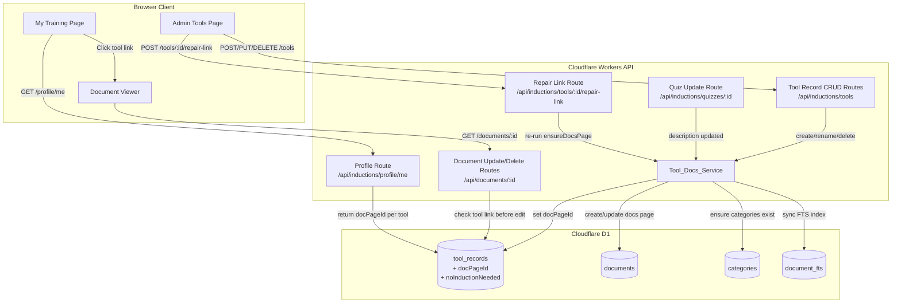
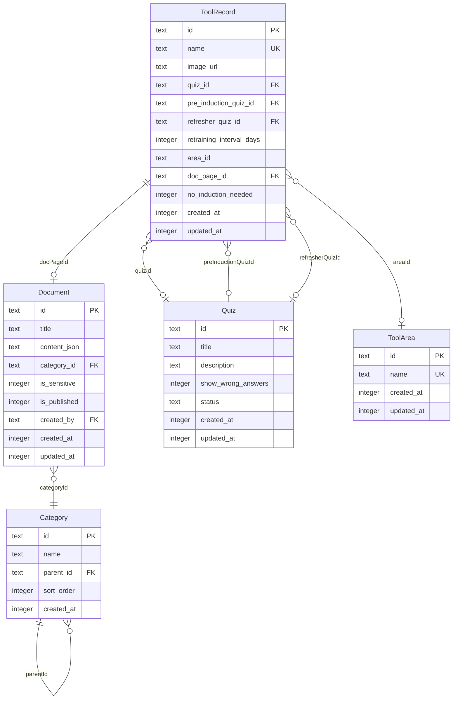

# Design Document: Tool Docs Linking

## Overview

The Tool Docs Linking feature creates a bidirectional connection between the existing tool induction system and the documentation system. Every tool record gets a dedicated documentation page auto-created under a fixed category path (`Workshop Info > Equipment > [Tool Name]`), and every tool name on the My Training page becomes a clickable link to that page. Quiz description content (title + description markdown, not questions/answers) syncs to a collapsible "About this tool" section on each docs page. System-managed sections (Training_Link, Description_Section, title, category, publish status) are locked while the tool link is active, but docs editors can freely add content below. Tool deletion gracefully releases the page, and re-creating a tool with the same name re-links the orphaned page.

This feature extends the existing Cloudflare Workers + Hono API, Cloudflare D1 database, React SPA, and shared packages — no new infrastructure is needed.

### Key Design Decisions

- **Two new nullable columns on `toolRecords`**: `docPageId` (text, references `documents.id`) and `noInductionNeeded` (integer, default 0). Both nullable with defaults so the migration is non-destructive and additive — existing rows are unaffected.
- **Tool_Docs_Service as a backend service module**: A pure function service (`packages/worker/src/services/tool-docs.ts`) encapsulating all logic for auto-creation, syncing, locking, unlocking, and renaming of tool docs pages. Called from existing tool CRUD routes and quiz update routes — not a separate API endpoint.
- **Page locking via lookup, not a stored flag**: Whether a docs page is "locked" is determined by checking if any `toolRecords.docPageId` references it. No separate lock column is needed — the FK reference IS the lock. The document update/delete routes check for this reference before allowing modifications to locked fields.
- **Custom ProseMirror nodes for structured content**: The Training_Link is a `trainingLink` node type with `toolId` and `toolName` attrs. The Description_Section uses the existing `details`/`detailsSummary` pattern (collapsible) with a special `data-system-managed: true` attr to mark it as non-editable.
- **Client-side filtering**: Search and area filter on My Training are purely client-side — the `/api/inductions/profile/me` endpoint already returns all tools. No new API endpoints for search.
- **Disambiguation by most-recently-updated**: When linking by title match, only unlinked pages (where no other tool's `docPageId` points to them) are considered, and the most recently updated wins.
- **Graceful error handling**: Docs page creation/sync failures are logged but never block tool CRUD operations. The tool record is always created/updated/deleted successfully.
- **Quiz description → ProseMirror conversion**: Reuses the existing `parseMarkdown()` from `@hacmandocs/shared` to convert quiz description markdown to ProseMirror JSON nodes for the Description_Section content.

### Technology Stack (No Additions)

This feature uses the existing stack entirely:

| Layer | Technology | Usage |
|---|---|---|
| Database | Cloudflare D1 + Drizzle ORM | Two new columns via ALTER TABLE |
| API | Hono on Cloudflare Workers | Extended tool CRUD, document update guards |
| Frontend | React + React Router | Extended MemberProfilePage, document viewer |
| Rich Text | TipTap/ProseMirror | Custom nodes for TrainingLink, details section |
| Markdown | unified/remark via `@hacmandocs/shared` | Quiz description → ProseMirror JSON |
| Testing | Vitest + fast-check | Property-based tests for service logic |

## Architecture



### Request Flows

**Tool Creation:**
1. Admin POSTs to `/api/inductions/tools` with tool data
2. Tool record is inserted into `tool_records`
3. Tool_Docs_Service is called: ensures Equipment_Category exists → checks for orphaned page by title → creates new page or re-links orphaned page → stores `docPageId` on tool record
4. If docs creation fails, error is logged, tool record creation still succeeds

**Quiz Description Update:**
1. Admin PUTs to `/api/inductions/quizzes/:id` with updated description
2. Quiz record is updated
3. Tool_Docs_Service finds all tool records referencing this quiz (via `quizId`, `preInductionQuizId`, or `refresherQuizId`) that have a `docPageId`
4. For each linked docs page, the Description_Section is rebuilt from the quiz description markdown and the page's `contentJson` is updated, preserving all content below

**Tool Rename:**
1. Admin PUTs to `/api/inductions/tools/:id` with new name
2. Tool record name is updated
3. Tool_Docs_Service updates the linked docs page title + Training_Link text + FTS index

**Tool Deletion:**
1. Admin DELETEs `/api/inductions/tools/:id`
2. Tool_Docs_Service removes Training_Link from docs page content, removes system-managed attrs from Description_Section, sets `docPageId` to null
3. Tool record is deleted — docs page remains as a normal editable document

**Admin Repair Link:**
1. Admin clicks "Repair Link" button on the Admin Tools Page for a specific tool
2. Frontend POSTs to `/api/inductions/tools/:id/repair-link`
3. Route fetches the tool record, then calls `ensureDocsPage` with the tool's current name and quiz description
4. If `ensureDocsPage` succeeds, the tool record's `docPageId` is updated (or confirmed); returns 200 with the `docPageId`
5. If it fails, returns 500 with error detail. This covers stale/missing links without needing a reconciliation cron job

**Document Edit Guard:**
1. Editor PUTs to `/api/documents/:id` with changes
2. Document route checks if any `toolRecords.docPageId` references this document
3. If linked: rejects title changes, category changes, and modifications to Training_Link or Description_Section nodes; allows changes to content below the Description_Section
4. If not linked: normal edit flow

## Components and Interfaces

### Backend Components

| Component | File | Responsibility |
|---|---|---|
| `Tool_Docs_Service` | `packages/worker/src/services/tool-docs.ts` | Auto-create, sync, lock/unlock, rename docs pages |
| Tool CRUD routes (extended) | `packages/worker/src/routes/inductions.ts` | Call Tool_Docs_Service on create/update/delete |
| Repair Link route (new) | `packages/worker/src/routes/inductions.ts` | `POST /api/inductions/tools/:id/repair-link` — re-runs `ensureDocsPage` for a single tool |
| Quiz routes (extended) | `packages/worker/src/routes/inductions.ts` | Call Tool_Docs_Service on description update |
| Document routes (extended) | `packages/worker/src/routes/documents.ts` | Guard locked fields on linked docs pages |
| Profile route (extended) | `packages/worker/src/routes/inductions.ts` | Return `docPageId` and `areaId`/`areaName` per tool |

### Frontend Components

| Component | File | Responsibility |
|---|---|---|
| `MemberProfilePage` (extended) | `packages/web/src/pages/inductions/MemberProfilePage.tsx` | Render tool names as links, search input, area filter dropdown, "no induction" section |
| `TrainingLinkNode` (new) | TipTap extension in `RichTextEditor` | Render the Training_Link as a read-only navigable link in the document viewer |
| `DetailsNode` (new/extended) | TipTap extension in `RichTextEditor` | Render collapsible "About this tool" section, mark system-managed content non-editable |
| `RepairLinkButton` (new) | `packages/web/src/pages/inductions/AdminToolsPage.tsx` | Per-tool "Repair Link" button on the Admin Tools Page; POSTs to `/api/inductions/tools/:id/repair-link` and shows success/error feedback |

### Key Interfaces

```typescript
// ── Tool_Docs_Service Interface ──────────────────────────────────────
// packages/worker/src/services/tool-docs.ts

export interface ToolDocsService {
  /**
   * Auto-create or re-link a docs page for a tool.
   * Called after tool record creation.
   * Returns the docPageId on success, null on failure.
   */
  ensureDocsPage(params: {
    toolId: string;
    toolName: string;
    quizDescription: string | null; // markdown
    createdBy: string; // user ID for doc creation
  }): Promise<string | null>;

  /**
   * Sync the Description_Section from quiz description markdown.
   * Called after quiz description update.
   */
  syncDescription(params: {
    docPageId: string;
    quizDescription: string | null; // markdown
  }): Promise<void>;

  /**
   * Update title and Training_Link on tool rename.
   */
  syncRename(params: {
    docPageId: string;
    newToolName: string;
  }): Promise<void>;

  /**
   * Release a docs page: remove Training_Link, remove system attrs,
   * set docPageId to null on the tool record.
   * Called before tool deletion.
   * If docPageId is null (e.g. pre-migration rows), this is a no-op.
   */
  releaseDocsPage(params: {
    toolId: string;
    docPageId: string | null;
  }): Promise<void>;
}

// ── ProseMirror Node Types for Tool Docs ─────────────────────────────

/** Training_Link node — first node in docs page content */
interface TrainingLinkNode {
  type: 'trainingLink';
  attrs: {
    toolId: string;
    toolName: string;
  };
}

/**
 * Description_Section node — collapsible "About this tool" section.
 * Uses the standard `details` ProseMirror node type with a
 * `detailsSummary` child and the quiz description content as body.
 */
interface DescriptionSectionNode {
  type: 'details';
  attrs: {
    'data-system-managed': true;
  };
  content: [
    {
      type: 'detailsSummary';
      content: [{ type: 'text'; text: 'About this tool' }];
    },
    ...DocumentNode[] // quiz description content as ProseMirror nodes
  ];
}

// ── Extended Profile Response ────────────────────────────────────────

interface ProfileToolInfo {
  id: string;
  name: string;
  quizId: string | null;
  preInductionQuizId: string | null;
  refresherQuizId: string | null;
  retrainingIntervalDays: number | null;
  areaId: string | null;
  areaName: string | null;
  docPageId: string | null;
  noInductionNeeded: boolean;
  passedPreInduction?: boolean;
}

// ── Page Lock Check (used in document routes) ────────────────────────

/**
 * Check if a document is linked to a tool record.
 * Returns the tool record if linked, null otherwise.
 */
async function getLinkedToolRecord(
  db: DrizzleD1Database,
  docPageId: string,
): Promise<ToolRecord | null>;

// ── Content Manipulation Utilities ───────────────────────────────────

/**
 * Build the initial content JSON for a tool docs page.
 * Produces: [TrainingLink, DescriptionSection]
 */
function buildToolDocsContent(
  toolId: string,
  toolName: string,
  quizDescription: string | null,
): DocumentNode;

/**
 * Replace the Description_Section in existing page content
 * while preserving all user-authored content below.
 */
function replaceDescriptionSection(
  existingContent: DocumentNode,
  newQuizDescription: string | null,
): DocumentNode;

/**
 * Update the Training_Link node's toolName in page content.
 */
function updateTrainingLink(
  existingContent: DocumentNode,
  newToolName: string,
): DocumentNode;

/**
 * Remove the Training_Link and system-managed attrs from page content.
 * Used when a tool is deleted to release the page.
 */
function removeSystemNodes(
  existingContent: DocumentNode,
): DocumentNode;

/**
 * Validate that a proposed document update does not modify
 * locked sections (TrainingLink, DescriptionSection, title, category).
 * Returns an error message if the edit is rejected, null if allowed.
 */
function validateLockedEdit(
  existingContent: DocumentNode,
  proposedContent: DocumentNode,
): string | null;
```

## Data Models

### Schema Changes (Migration)

Two new nullable columns are added to the existing `tool_records` table via `ALTER TABLE`. This is a non-destructive, additive migration — no table recreation, no data copying.

```sql
-- Migration: 0011_add_tool_docs_linking.sql

-- Add docPageId column — nullable FK to documents table
ALTER TABLE tool_records ADD COLUMN doc_page_id TEXT REFERENCES documents(id);

-- Add noInductionNeeded flag — nullable boolean, default 0 (false)
ALTER TABLE tool_records ADD COLUMN no_induction_needed INTEGER DEFAULT 0;
```

### Updated Drizzle Schema

The `toolRecords` table definition in `packages/worker/src/db/schema.ts` is extended:

```typescript
export const toolRecords = sqliteTable(
  "tool_records",
  {
    id: text("id").primaryKey(),
    name: text("name").notNull().unique(),
    imageUrl: text("image_url"),
    quizId: text("quiz_id").references(() => quizzes.id),
    preInductionQuizId: text("pre_induction_quiz_id").references(() => quizzes.id),
    refresherQuizId: text("refresher_quiz_id").references(() => quizzes.id),
    retrainingIntervalDays: integer("retraining_interval_days"),
    areaId: text("area_id"),
    // ── New columns for Tool Docs Linking ──
    docPageId: text("doc_page_id").references(() => documents.id),
    noInductionNeeded: integer("no_induction_needed").default(0),
    createdAt: integer("created_at").notNull(),
    updatedAt: integer("updated_at").notNull(),
  },
);
```

### Category Setup

The Tool_Docs_Service ensures a fixed category path exists on first use:

```
Workshop Info (top-level category, parentId: null)
  └── Equipment (child category, parentId: <workshop_info_id>)
```

Both categories are created if they don't exist. The Equipment category ID is used as the `categoryId` for all tool docs pages. Categories are found by name match + parent relationship — not by hardcoded IDs.

### Document Content Structure

A tool docs page has this ProseMirror JSON structure:

```json
{
  "type": "doc",
  "content": [
    {
      "type": "trainingLink",
      "attrs": {
        "toolId": "abc-123",
        "toolName": "Laser Cutter"
      }
    },
    {
      "type": "details",
      "attrs": { "data-system-managed": true },
      "content": [
        {
          "type": "detailsSummary",
          "content": [{ "type": "text", "text": "About this tool" }]
        },
        {
          "type": "paragraph",
          "content": [{ "type": "text", "text": "Quiz description content here..." }]
        }
      ]
    },
    // ── User-authored content below this line is freely editable ──
    {
      "type": "paragraph",
      "content": [{ "type": "text", "text": "" }]
    }
  ]
}
```

### Entity Relationship (Extended)




## Correctness Properties

*A property is a characteristic or behavior that should hold true across all valid executions of a system — essentially, a formal statement about what the system should do. Properties serve as the bridge between human-readable specifications and machine-verifiable correctness guarantees.*

### Property 1: Tool partitioning completeness

*For any* set of tool records with varying certification states (active, expiring_soon, expired, none), quiz associations (quizId, preInductionQuizId, refresherQuizId, all null), and noInductionNeeded flag values (true/false), and for any member's certification set, the partitioning function SHALL place every tool in exactly one section (available, completed, expired, or no-induction-needed), with no tool missing and no tool appearing in more than one section.

**Validates: Requirements 1.1, 1.4, 5.3, 5.4, 5.5**

### Property 2: Auto-creation produces correct page

*For any* valid tool name and any quiz description (including null), calling `ensureDocsPage` SHALL produce a docs page where: the title matches the tool name, the `categoryId` equals the Equipment category ID, `isPublished` is 1, and the tool record's `docPageId` is set to the created page's ID.

**Validates: Requirements 2.1, 2.3, 3.1, 3.4, 3.6, 8.2, 13.1**

### Property 3: Generated page content structure

*For any* tool name and any quiz description (including null), the generated page content SHALL have a `trainingLink` node at index 0 with the correct `toolId` and `toolName` attrs, a `details` node at index 1 with `data-system-managed: true` and a `detailsSummary` child containing the text "About this tool", and quiz description content parsed from markdown (or placeholder text when the description is null/empty).

**Validates: Requirements 3.2, 4.3, 9.1, 9.2, 11.1**

### Property 4: Description sync preserves user content

*For any* existing docs page content with user-authored nodes below the Description_Section, and any new quiz description string (including null/empty), calling `replaceDescriptionSection` SHALL produce content where the Description_Section reflects the new description, and all user-authored nodes below it are identical to the original in order and content.

**Validates: Requirements 4.1, 4.4**

### Property 5: Client-side filter correctness

*For any* list of tools with varying names and areaIds, any search string (including empty), and any selected areaId (including null for "all"): the filtered result SHALL contain exactly the tools whose name contains the search string (case-insensitive) AND whose areaId matches the selected area (or all tools if no area is selected). When both search and area filter are empty/null, the result SHALL equal the original list.

**Validates: Requirements 6.2, 6.4, 6.5, 6.6, 6.7**

### Property 6: Rename propagates to page title and Training_Link

*For any* tool rename from oldName to newName with a linked docs page, calling `syncRename` SHALL update the page title to newName AND update the Training_Link node's `toolName` attr to newName, while preserving all other content.

**Validates: Requirements 7.1, 11.3**

### Property 7: Disambiguation selects correct unlinked page

*For any* set of docs pages under the Equipment category where some share the same title, some are linked to other tools (via `docPageId`) and some are unlinked, and the unlinked pages have varying `updatedAt` timestamps: the disambiguation function SHALL select only from unlinked pages, and among those, SHALL select the one with the most recent `updatedAt` timestamp.

**Validates: Requirements 8.4, 8.5, 12.5, 12.6**

### Property 8: Locked page rejects system-managed field edits

*For any* docs page that is linked to a tool record (i.e., a `toolRecords.docPageId` references it), and any proposed edit that changes the title, changes the categoryId, deletes the page, unpublishes the page, modifies the Training_Link node, or modifies the Description_Section node: the system SHALL reject the edit with an error message indicating the field is system-managed.

**Validates: Requirements 10.1, 10.2, 10.3, 10.4, 10.6, 13.2**

### Property 9: Locked page allows user content edits

*For any* docs page that is linked to a tool record, and any proposed content change that only modifies, adds, or removes nodes below the Description_Section (index 1) while keeping the Training_Link (index 0) and Description_Section (index 1) identical: the `validateLockedEdit` function SHALL accept the edit.

**Validates: Requirements 10.5**

### Property 10: Release removes system nodes and preserves page

*For any* docs page linked to a tool record with user-authored content below the Description_Section, calling `removeSystemNodes` SHALL produce content where: the Training_Link node is absent, the Description_Section's `data-system-managed` attr is removed, and all user-authored content below is preserved in its original order. The docs page itself SHALL still exist in the database (not deleted).

**Validates: Requirements 11.4, 12.1, 12.3, 12.4**

### Property 11: Re-link restores system nodes on orphaned page

*For any* orphaned docs page (previously released from a tool) with existing user-authored content, calling `ensureDocsPage` with a matching tool name SHALL produce content where: a Training_Link node is at index 0 with the correct toolId/toolName, a Description_Section is at index 1 with the current quiz description, and all pre-existing user-authored content is preserved below in its original order.

**Validates: Requirements 12.8**

## Error Handling

### Tool CRUD with Docs Sync

| Error | Handling | User Feedback |
|---|---|---|
| Docs page creation fails during tool create | Log error, complete tool creation with `docPageId = null` | Tool created successfully; admin may see a warning if docs page is missing |
| Docs page title update fails during tool rename | Log error, complete tool rename | Tool renamed successfully; page title may be stale until next sync |
| Docs page release fails during tool delete | Log error, complete tool deletion | Tool deleted successfully; page may retain system nodes |
| Category creation fails (Workshop Info / Equipment) | Log error, skip docs page creation | Tool created without docs page; retry on next tool creation |
| FTS5 index sync fails | Log error, docs page still updated | Search may not reflect changes until next update |
| Ambiguous title match during disambiguation | Pick most recently updated unlinked page; log a warning with: tool name, number of matches, IDs of all matching pages, and which page was selected | No user-facing error — server-side log only for admin visibility |
| `releaseDocsPage` called with null `docPageId` | No-op gracefully — skip all page cleanup, no error, no logging | Tool deletion proceeds normally (covers pre-migration rows that have no docs page yet) |

### Document Edit Guards

| Error | Handling | User Feedback |
|---|---|---|
| Editor attempts to change title of linked page | Return 400 | "This page's title is managed by the linked tool record and cannot be changed manually." |
| Editor attempts to move linked page to different category | Return 400 | "This page's category is managed by the linked tool record and cannot be changed manually." |
| Editor attempts to delete linked page | Return 400 | "This page is linked to a tool record and cannot be deleted. Delete the tool record first to release this page." |
| Editor attempts to unpublish linked page | Return 400 | "This page is linked to a tool record and must remain published." |
| Editor modifies Training_Link or Description_Section | Return 400 | "The training link and 'About this tool' section are system-managed and cannot be edited while a tool is linked." |
| Editor modifies content below system sections | Allow edit, return 200 | Normal success response |

### Quiz Description Sync

| Error | Handling | User Feedback |
|---|---|---|
| No tools reference the updated quiz | No-op, quiz update succeeds | Normal success response |
| One of multiple linked pages fails to sync | Log error for failed page, continue syncing others | Quiz updated; some pages may have stale descriptions |
| Markdown parsing fails for quiz description | Use placeholder text, log warning | Description_Section shows placeholder; quiz description still saved |

### Profile / My Training Page

| Error | Handling | User Feedback |
|---|---|---|
| Tool has `docPageId` but referenced document is deleted | Treat as `docPageId = null`, render as plain text | Tool name shown without link |
| Area filter returns no results | Show empty state with message | "No tools found matching your filters." |

## Testing Strategy

### Unit Tests (Vitest, Example-Based)

Unit tests cover specific scenarios and edge cases:

- **Category bootstrapping**: Verify `ensureEquipmentCategory` creates both "Workshop Info" and "Equipment" categories when they don't exist, and returns existing IDs when they do (Req 2.2)
- **Docs page creation failure isolation**: Mock DB failure during docs page creation, verify tool record still created with `docPageId = null` (Req 3.5)
- **Rename failure isolation**: Mock page update failure, verify tool rename still succeeds (Req 7.3)
- **Null docPageId link rendering**: Verify tools with null `docPageId` render as plain text (Req 1.5)
- **Unpublished page link suppression**: Verify tools with unpublished docs page render as plain text (Req 13.3)
- **Admin tools page checkbox**: Verify `noInductionNeeded` checkbox renders and submits correctly (Req 5.2)
- **FTS5 sync on rename**: Integration test verifying FTS5 entry is updated after docs page title change (Req 7.2)
- **Locked page error messages**: Verify specific error message text for each type of locked edit attempt (Req 10.7)
- **No disambiguation needed**: Verify that when no matching unlinked page exists, a new page is created (Req 8.6, 12.7)
- **Training_Link navigation URL**: Verify the Training_Link renders with the correct `/inductions/profile#tool-{id}` URL (Req 11.2)
- **Collapsible section default state**: Verify Description_Section renders collapsed by default in the viewer (Req 9.3)

### Property-Based Tests (Vitest + fast-check)

Property-based tests use `fast-check` with Vitest, minimum 100 iterations per property. Each test references its design document property.

| Property | Test Description | Tag |
|---|---|---|
| Property 1 | Generate random tool sets with varying cert states, quiz associations, noInductionNeeded flags, and member certs. Verify each tool appears in exactly one section. | Feature: tool-docs-linking, Property 1: Tool partitioning completeness |
| Property 2 | Generate random tool names and quiz descriptions (including null). Call `ensureDocsPage` with mocked DB. Verify page title, categoryId, isPublished, and docPageId. | Feature: tool-docs-linking, Property 2: Auto-creation produces correct page |
| Property 3 | Generate random tool names and quiz descriptions. Call `buildToolDocsContent`. Verify node structure: trainingLink at [0], details at [1] with correct summary, description content. | Feature: tool-docs-linking, Property 3: Generated page content structure |
| Property 4 | Generate random page content (trainingLink + details + N random user nodes). Generate random new descriptions. Call `replaceDescriptionSection`. Verify user nodes unchanged. | Feature: tool-docs-linking, Property 4: Description sync preserves user content |
| Property 5 | Generate random tool lists with names and areaIds, random search strings, random selected areaIds. Apply filter function. Verify results match both criteria; empty filters return all. | Feature: tool-docs-linking, Property 5: Client-side filter correctness |
| Property 6 | Generate random page content with trainingLink + details + user nodes. Call `updateTrainingLink` with new name. Verify title updated, trainingLink updated, other content preserved. | Feature: tool-docs-linking, Property 6: Rename propagates to page title and Training_Link |
| Property 7 | Generate random sets of pages with same title, some linked (docPageId set) and some unlinked, varying updatedAt. Call disambiguation function. Verify selection is unlinked and most recent. | Feature: tool-docs-linking, Property 7: Disambiguation selects correct unlinked page |
| Property 8 | Generate random linked page content. Generate edits that modify title, categoryId, trainingLink, or descriptionSection. Verify `validateLockedEdit` rejects each. | Feature: tool-docs-linking, Property 8: Locked page rejects system-managed field edits |
| Property 9 | Generate random linked page content. Generate edits that only modify/add/remove nodes at index >= 2. Verify `validateLockedEdit` accepts. | Feature: tool-docs-linking, Property 9: Locked page allows user content edits |
| Property 10 | Generate random page content with trainingLink + details + user nodes. Call `removeSystemNodes`. Verify trainingLink absent, system attrs removed, user nodes preserved. | Feature: tool-docs-linking, Property 10: Release removes system nodes and preserves page |
| Property 11 | Generate random orphaned page content (no trainingLink, details without system attr, user nodes). Call `ensureDocsPage` re-link logic. Verify trainingLink at [0], details at [1], user content preserved. | Feature: tool-docs-linking, Property 11: Re-link restores system nodes on orphaned page |
