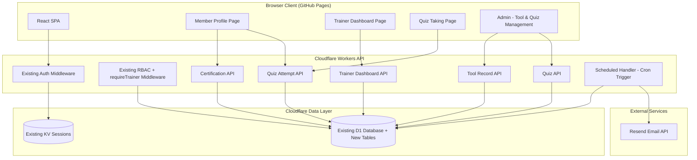
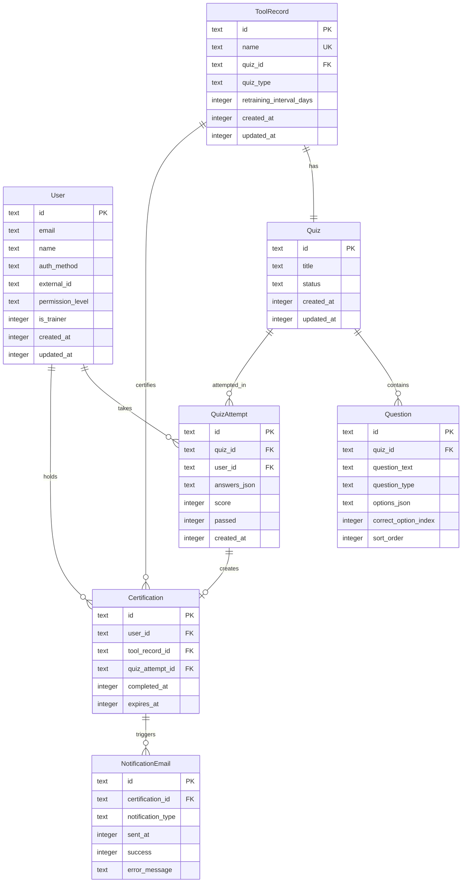

# Design Document: Tool Induction System

## Overview

The Tool Induction System extends the existing hacmandocs platform with online tool induction and refresher training capabilities. Members self-serve by selecting tools, completing online quizzes (100% pass mark, unlimited attempts), and tracking their certification status. Trainers monitor completions to sign members off in the external makerspace member system. Admins manage tool records and quizzes.

This is not a standalone application — it extends the existing Cloudflare Workers + Hono API, Cloudflare D1 database, React SPA, and authentication/RBAC infrastructure. New tables are added to the existing D1 schema, new Hono routes are mounted under `/api/inductions/*`, and new React pages are added to the existing SPA.

### Key Design Decisions

- **Extend, don't duplicate**: All new tables are added to the existing D1 database via a new Drizzle migration. The existing `users` table is referenced by foreign keys — no separate user management. The existing auth middleware, session helpers, and RBAC middleware are reused directly.
- **Trainer as a boolean flag, not a role**: Instead of adding Trainer to the permission hierarchy, an `is_trainer` boolean column is added to the existing `users` table. Any user at any permission level (Viewer, Editor, Approver, Admin) can also be a trainer. The existing permission hierarchy stays unchanged. A `requireTrainer` middleware checks `is_trainer = true` OR `permissionLevel = 'Admin'` (Admins always have trainer access). Admins toggle the `is_trainer` flag via a checkbox on the admin user management page.
- **Quiz model inspired by Google Forms**: Quizzes contain ordered questions with multiple-choice or true/false types. Each question has exactly one correct answer. The quiz lifecycle is `draft → published → archived`. Published quizzes are immutable (existing questions can't be edited) but new questions can be appended.
- **Certification expiry via Cron Trigger**: A Cloudflare Workers scheduled handler runs daily to check for expiring/expired certifications and sends notification emails via Resend (free tier: 100 emails/day, works well with Workers via simple fetch). A `notification_emails` table tracks which emails have been sent to enforce the "at most once per type per expiry cycle" constraint.
- **No external system writes**: The Induction System is read-only with respect to the external makerspace member system. Trainers use the Trainer Dashboard to identify completions, then manually sign members off in the external system. Requirement 10 (API integration) is deferred to a future release.
- **Resend for email delivery**: Chosen over SendGrid/Mailgun because Resend has a generous free tier (100 emails/day), a simple REST API that works natively with `fetch` in Workers (no SDK needed), and good developer experience. The API key is stored as a Worker secret.

### Technology Stack (Additions)

| Layer | Technology | Notes |
|---|---|---|
| Email Service | Resend | REST API via `fetch`, free tier 100 emails/day |
| Scheduled Jobs | Cloudflare Workers Cron Triggers | Daily check for expiring certifications |
| Testing | Vitest + fast-check | Same as existing — property-based tests for core logic |

## Architecture



### Request Flow

1. All requests pass through the existing Auth Middleware (session lookup in KV) → RBAC Middleware (unchanged for docs routes) or `requireTrainer` middleware (for trainer dashboard routes)
2. Induction API routes are mounted under `/api/inductions/*` on the existing Hono app
3. Quiz taking, certification creation, and attempt recording go through the Attempt API → D1
4. The Cron Trigger runs daily, queries D1 for expiring/expired certs, and sends emails via Resend

### Deployment Changes

- **wrangler.toml**: Add `[triggers]` section with `crons = ["0 8 * * *"]` (daily at 08:00 UTC) and a `RESEND_API_KEY` secret binding
- **Worker entry point**: Add a `scheduled` export handler alongside the existing `fetch` handler
- **D1 migration**: New Drizzle migration file adds induction tables to the existing database

## Components and Interfaces

### Frontend Components (New Pages in Existing SPA)

| Component | Responsibility |
|---|---|
| `MemberProfilePage` | Shows available tools, completed certifications, expiring/expired refreshers (Req 4) |
| `QuizTakingPage` | Presents quiz questions, collects answers, submits attempt, shows result (Req 3) |
| `TrainerDashboardPage` | Lists member completions, expired certs, expiring-soon certs, filter/search (Req 6) |
| `AdminToolsPage` | CRUD for Tool Records (Req 1) |
| `AdminQuizzesPage` | CRUD for Quizzes and Questions, publish/archive lifecycle (Req 2) |
| `QuizEditorComponent` | Inline question editor for creating/editing quiz questions |

### Backend Services (New Hono Routes on Existing Worker)

All new routes are mounted under `/api/inductions/` on the existing Hono app via `app.route("/api/inductions", inductionsApp)`.

| Route Group | Responsibility | Key Endpoints |
|---|---|---|
| Tool Records | CRUD for tool records (Admin only) | `GET/POST/PUT/DELETE /api/inductions/tools` |
| Quizzes | CRUD, publish, archive quizzes (Admin only) | `GET/POST/PUT /api/inductions/quizzes`, `POST .../publish`, `POST .../archive` |
| Questions | CRUD for questions within a quiz (Admin only) | `GET/POST/PUT/DELETE /api/inductions/quizzes/:id/questions` |
| Attempts | Submit quiz attempt, get attempt history | `POST /api/inductions/quizzes/:id/attempt`, `GET /api/inductions/attempts/me` |
| Certifications | Get member's certifications, get cert by tool | `GET /api/inductions/certifications/me`, `GET /api/inductions/certifications/tool/:id` |
| Trainer | Dashboard data: completions, expiring, expired, member/tool detail | `GET /api/inductions/trainer/*` |

### Key Interfaces

```typescript
// ── New types added to packages/shared/src/types.ts ──

/** Quiz types */
export type QuizType = 'online_induction' | 'refresher';

/** Quiz lifecycle states */
export type QuizStatus = 'draft' | 'published' | 'archived';

/** Question types */
export type QuestionType = 'multiple_choice' | 'true_false';

/** Certification status */
export type CertificationStatus = 'active' | 'expiring_soon' | 'expired';

/** Email notification types for cert expiry */
export type ExpiryNotificationType = 'warning_14d' | 'expired' | 'post_expiry_30d';

/** Permission levels — unchanged from existing Docs_System (Trainer is a boolean flag, not a role) */
// PermissionLevel stays as: 'Viewer' | 'Editor' | 'Approver' | 'Admin'
// No change to the existing PermissionLevel type

// ── Domain interfaces ──

export interface ToolRecord {
  id: string;
  name: string;
  quizId: string;
  quizType: QuizType;
  retrainingIntervalDays: number | null; // null for online_induction type
  createdAt: number;
  updatedAt: number;
}

export interface Quiz {
  id: string;
  title: string;
  status: QuizStatus;
  createdAt: number;
  updatedAt: number;
}

export interface Question {
  id: string;
  quizId: string;
  questionText: string;
  questionType: QuestionType;
  options: string[];       // JSON array of answer option strings
  correctOptionIndex: number;
  sortOrder: number;
}

export interface QuizAttempt {
  id: string;
  quizId: string;
  userId: string;
  answersJson: number[];   // array of selected option indices
  score: number;           // percentage 0-100
  passed: boolean;
  createdAt: number;
}

export interface Certification {
  id: string;
  userId: string;
  toolRecordId: string;
  quizAttemptId: string;
  completedAt: number;
  expiresAt: number | null; // null for online_induction (permanent)
}


// ── Service interfaces ──

/** Scores a quiz attempt and determines pass/fail */
export interface QuizScoringService {
  scoreAttempt(quiz: Quiz, questions: Question[], answers: number[]): {
    score: number;
    passed: boolean;
    correctCount: number;
    totalCount: number;
  };
}

/** Calculates certification expiry based on tool record config */
export interface CertificationService {
  createCertification(
    userId: string,
    toolRecord: ToolRecord,
    quizAttemptId: string,
    completedAt: number,
  ): Certification;
  
  recalculateExpiry(
    certification: Certification,
    newIntervalDays: number,
  ): Certification;
  
  getStatus(certification: Certification, now: number): CertificationStatus;
}

/** Determines which notification emails to send for expiring certs */
export interface ExpiryNotificationService {
  getNotificationsToSend(
    certifications: Certification[],
    alreadySent: Array<{ certificationId: string; notificationType: ExpiryNotificationType }>,
    now: number,
  ): Array<{
    certificationId: string;
    userId: string;
    toolRecordId: string;
    notificationType: ExpiryNotificationType;
  }>;
}
```

## Data Models

### New D1 Tables (Drizzle Schema Extension)

The following tables are added to the existing `packages/worker/src/db/schema.ts` via a new Drizzle migration. All tables reference the existing `users` table by foreign key.



### Drizzle Schema Additions

```typescript
// ── Tool Induction Tables (added to packages/worker/src/db/schema.ts) ──

export const quizzes = sqliteTable(
  "quizzes",
  {
    id: text("id").primaryKey(),
    title: text("title").notNull(),
    status: text("status").notNull().default("draft"),
    createdAt: integer("created_at").notNull(),
    updatedAt: integer("updated_at").notNull(),
  },
  (table) => [
    check("quiz_status_check", sql`${table.status} IN ('draft', 'published', 'archived')`),
  ]
);

export const questions = sqliteTable(
  "questions",
  {
    id: text("id").primaryKey(),
    quizId: text("quiz_id").notNull().references(() => quizzes.id),
    questionText: text("question_text").notNull(),
    questionType: text("question_type").notNull(),
    optionsJson: text("options_json").notNull(), // JSON array of strings
    correctOptionIndex: integer("correct_option_index").notNull(),
    sortOrder: integer("sort_order").notNull().default(0),
  },
  (table) => [
    check("question_type_check", sql`${table.questionType} IN ('multiple_choice', 'true_false')`),
  ]
);

export const toolRecords = sqliteTable(
  "tool_records",
  {
    id: text("id").primaryKey(),
    name: text("name").notNull().unique(),
    quizId: text("quiz_id").notNull().references(() => quizzes.id),
    quizType: text("quiz_type").notNull(),
    retrainingIntervalDays: integer("retraining_interval_days"), // null for online_induction
    createdAt: integer("created_at").notNull(),
    updatedAt: integer("updated_at").notNull(),
  },
  (table) => [
    check("quiz_type_check", sql`${table.quizType} IN ('online_induction', 'refresher')`),
  ]
);

export const quizAttempts = sqliteTable("quiz_attempts", {
  id: text("id").primaryKey(),
  quizId: text("quiz_id").notNull().references(() => quizzes.id),
  userId: text("user_id").notNull().references(() => users.id),
  answersJson: text("answers_json").notNull(), // JSON array of selected indices
  score: integer("score").notNull(),           // 0-100
  passed: integer("passed").notNull(),         // 0 or 1
  createdAt: integer("created_at").notNull(),
});

export const certifications = sqliteTable("certifications", {
  id: text("id").primaryKey(),
  userId: text("user_id").notNull().references(() => users.id),
  toolRecordId: text("tool_record_id").notNull().references(() => toolRecords.id),
  quizAttemptId: text("quiz_attempt_id").notNull().references(() => quizAttempts.id),
  completedAt: integer("completed_at").notNull(),
  expiresAt: integer("expires_at"), // null for online_induction (permanent)
});

export const notificationEmails = sqliteTable("notification_emails", {
  id: text("id").primaryKey(),
  certificationId: text("certification_id").notNull().references(() => certifications.id),
  notificationType: text("notification_type").notNull(),
  sentAt: integer("sent_at").notNull(),
  success: integer("success").notNull(), // 0 or 1
  errorMessage: text("error_message"),
});
```

### Users Table Extension (is_trainer flag)

The existing `users` table gets a new `is_trainer` column added via the Drizzle migration. The existing permission hierarchy (Viewer, Editor, Approver, Admin) and its CHECK constraint remain unchanged.

```sql
-- Add is_trainer boolean column to existing users table (default 0 = false)
ALTER TABLE users ADD COLUMN is_trainer INTEGER NOT NULL DEFAULT 0;
```

The `PermissionLevel` type in `packages/shared/src/types.ts` is NOT modified — it stays as `'Viewer' | 'Editor' | 'Approver' | 'Admin'`.

A new `isTrainer` field is added to the `User` interface and `SessionData` to carry the trainer flag through the session.

The Drizzle schema for the `users` table is updated to include the new column:

```typescript
// Added to the existing users table definition in packages/worker/src/db/schema.ts
isTrainer: integer("is_trainer").notNull().default(0), // 0 = false, 1 = true
```

### RBAC Extension for Trainer Access

The existing `requireRole` middleware and its `LEVEL_RANK` hierarchy remain completely unchanged. The existing permission hierarchy (Viewer: 0, Editor: 1, Approver: 2, Admin: 3) is not modified.

A new `requireTrainer` middleware is added that checks the `is_trainer` flag on the session. Admins always pass the trainer check (they have implicit trainer access).

```typescript
// Added to packages/worker/src/middleware/rbac.ts

/** Middleware that requires the user to be a trainer (is_trainer=true) or Admin */
export function requireTrainer() {
  return createMiddleware<Env>(async (c, next) => {
    const session = c.get("session");
    if (!session.isTrainer && session.permissionLevel !== 'Admin') {
      return c.json({ error: "Insufficient permissions" }, 403);
    }
    await next();
  });
}
```

This approach means:
- The existing `requireRole` middleware works exactly as before for all Docs_System routes
- Trainer dashboard routes use `requireTrainer()` instead of `requireAnyRole('Trainer', 'Admin')`
- Admin routes still use `requireRole('Admin')` as before
- A user can be an Editor AND a trainer simultaneously

### Certification Status Resolution

Certification status is computed at query time, not stored:

```typescript
function getCertificationStatus(cert: Certification, now: number): CertificationStatus {
  if (cert.expiresAt === null) return 'active'; // permanent (online_induction)
  if (cert.expiresAt <= now) return 'expired';
  const daysRemaining = (cert.expiresAt - now) / 86400;
  if (daysRemaining <= 30) return 'expiring_soon';
  return 'active';
}
```

### Scheduled Handler (Cron Trigger)

The Worker entry point (`packages/worker/src/index.ts`) exports a `scheduled` handler alongside the existing Hono `fetch` handler:

```typescript
export default {
  fetch: app.fetch,
  async scheduled(event: ScheduledEvent, env: Env['Bindings'], ctx: ExecutionContext) {
    await processExpiryNotifications(env);
  },
};
```

The `processExpiryNotifications` function:
1. Queries `certifications` for refresher certs where `expires_at` is within 14 days, at expiry, or 30 days past expiry
2. Joins `notification_emails` to filter out already-sent notifications
3. Sends emails via Resend's REST API (`POST https://api.resend.com/emails`)
4. Records each send attempt in `notification_emails` (success or failure)

### Wrangler Configuration Changes

```toml
# Added to packages/worker/wrangler.toml

[triggers]
crons = ["0 8 * * *"]  # Daily at 08:00 UTC
```

The `RESEND_API_KEY` is added as a Worker secret via `wrangler secret put RESEND_API_KEY`.

### Frontend Routing Changes

New routes added to `packages/web/src/App.tsx`:

```tsx
{/* Induction routes — require login */}
<Route path="/inductions/profile" element={<ProtectedRoute><MemberProfilePage /></ProtectedRoute>} />
<Route path="/inductions/quiz/:id" element={<ProtectedRoute><QuizTakingPage /></ProtectedRoute>} />
<Route path="/inductions/trainer" element={<ProtectedRoute><TrainerDashboardPage /></ProtectedRoute>} />

{/* Admin induction management — nested under existing /admin */}
<Route path="tools" element={<AdminToolsPage />} />
<Route path="quizzes" element={<AdminQuizzesPage />} />
```

The `NavigationSidebar` component is extended with an "Inductions" section that shows:
- "My Training" link (→ Member Profile) for all authenticated users
- "Trainer Dashboard" link for users with `isTrainer = true` or Admin permission level
- "Manage Tools" and "Manage Quizzes" links for Admin users


## Correctness Properties

*A property is a characteristic or behavior that should hold true across all valid executions of a system — essentially, a formal statement about what the system should do. Properties serve as the bridge between human-readable specifications and machine-verifiable correctness guarantees.*

### Property 1: Tool record validation

*For any* tool record creation payload, the system SHALL accept it if and only if it has a non-empty name, a valid quiz type (`online_induction` or `refresher`), a valid associated quiz ID, and — when the quiz type is `refresher` — a positive retraining interval in days. When the quiz type is `online_induction`, the retraining interval SHALL be null.

**Validates: Requirements 1.1, 1.2, 1.3**

### Property 2: Duplicate tool name rejection

*For any* tool name that already exists in the system, attempting to create a new Tool_Record with the same name SHALL be rejected, regardless of other field values.

**Validates: Requirements 1.4**

### Property 3: Retraining interval recalculation

*For any* refresher-type Tool_Record with existing active Certifications and a new retraining interval, updating the interval SHALL recalculate the expiry date of every active Certification on that tool as `completedAt + (newIntervalDays * 86400)`.

**Validates: Requirements 1.6**

### Property 4: Question validation

*For any* question creation payload, the system SHALL accept it if and only if it has non-empty question text, a valid question type (`multiple_choice` or `true_false`), at least two answer options, and a correct option index that is a valid index within the options array.

**Validates: Requirements 2.2**

### Property 5: Published quiz immutability

*For any* quiz in `published` status, attempts to modify existing question text, answer options, or correct answer designation SHALL be rejected. Adding new questions to the quiz SHALL succeed.

**Validates: Requirements 2.3**

### Property 6: Quiz scoring and attempt recording

*For any* set of questions with known correct answers and any set of member-submitted answers, the score SHALL equal `(correctCount / totalCount) * 100` rounded to the nearest integer, and `passed` SHALL be `true` if and only if the score is exactly 100. The recorded Quiz_Attempt SHALL contain the member identity, quiz identity, submitted answers, calculated score, pass/fail result, and a timestamp — all non-null.

**Validates: Requirements 3.2, 3.3, 3.8**

### Property 7: Certification creation from passing attempt

*For any* passing quiz attempt (score = 100), the system SHALL create a Certification where: if the associated Tool_Record is `online_induction` type, `expiresAt` is null (permanent); if the Tool_Record is `refresher` type with interval N days, `expiresAt` equals `completedAt + (N * 86400)`.

**Validates: Requirements 3.4, 3.5**

### Property 8: Certification status computation

*For any* Certification and any timestamp `now`: if `expiresAt` is null, the status SHALL be `active`; if `expiresAt <= now`, the status SHALL be `expired`; if `expiresAt - now <= 30 * 86400`, the status SHALL be `expiring_soon`; otherwise the status SHALL be `active`.

**Validates: Requirements 4.3, 4.4, 7.1, 7.4**

### Property 9: Member profile available vs completed partitioning

*For any* member and any set of Tool_Records and Certifications, the "available" list SHALL contain exactly the Tool_Records for which the member has no active or expiring_soon Certification, and the "completed" list SHALL contain exactly the Tool_Records for which the member has an active or expiring_soon Certification. The union of available and completed (plus expired) SHALL equal the full set of Tool_Records, with no overlaps between available and completed.

**Validates: Requirements 4.1, 4.2**

### Property 10: Refresher certification sorting

*For any* list of refresher-type Certifications displayed on the Member_Profile, the list SHALL be sorted by `expiresAt` in ascending order (soonest-to-expire first).

**Validates: Requirements 4.5**

### Property 11: Induction system RBAC

*For any* user with a given permission level and `is_trainer` flag, and any induction system action: Admin SHALL have access to all actions (tool management, quiz management, trainer dashboard, member features) regardless of `is_trainer` flag; any user with `is_trainer = true` SHALL have access to the trainer dashboard and member features but NOT tool/quiz management or certification modification; any user with `is_trainer = false` and a non-Admin permission level SHALL have access to member features (profile, quiz taking) but NOT trainer dashboard or management actions. For any existing Docs_System (role, action) pair, the RBAC result SHALL be unchanged — the `is_trainer` flag has no effect on Docs_System permissions.

**Validates: Requirements 2.6, 5.2, 5.4, 5.5, 5.6, 6.7, 9.3, 9.4**

### Property 12: Certification renewal preserves history

*For any* expired refresher Certification, when the member passes the refresher Quiz again, the system SHALL create a new Certification with `expiresAt = now + (intervalDays * 86400)` and SHALL retain the original expired Certification record unchanged.

**Validates: Requirements 7.3**

### Property 13: Expiry notification scheduling with deduplication

*For any* set of refresher Certifications with varying expiry dates relative to `now`, and any set of already-sent notification records: the system SHALL produce a `warning_14d` notification for certs where `expiresAt - now` is between 0 and 14 days (inclusive), an `expired` notification for certs where `expiresAt <= now`, and a `post_expiry_30d` notification for certs where `now - expiresAt >= 30 days`. For any (certification, notification_type) pair that already appears in the sent records, the system SHALL NOT produce a duplicate notification.

**Validates: Requirements 8.1, 8.2, 8.3, 8.4**

## Error Handling

### Tool Record & Quiz Management Errors

| Error | Handling | User Feedback |
|---|---|---|
| Duplicate tool name | Reject with 409 Conflict | "A tool record with this name already exists." |
| Missing required fields (tool/quiz/question) | Reject with 400 | Field-specific validation messages |
| Invalid quiz type or question type | Reject with 400 | "Invalid quiz type. Must be one of: online_induction, refresher." |
| Publish quiz with zero questions | Reject with 400 | "Cannot publish a quiz with no questions." |
| Edit published question structure | Reject with 400 | "Cannot modify questions on a published quiz. You may add new questions." |
| Attempt on archived quiz | Reject with 400 | "This quiz has been archived and is no longer available." |
| Tool record not found | Return 404 | "Tool record not found." |
| Quiz not found | Return 404 | "Quiz not found." |

### Quiz Taking Errors

| Error | Handling | User Feedback |
|---|---|---|
| Incomplete answers (not all questions answered) | Reject with 400 | "Please answer all questions before submitting." |
| Invalid answer index | Reject with 400 | "Invalid answer selection." |
| Quiz not published | Reject with 400 | "This quiz is not currently available." |

### Permission Errors

| Error | Handling | User Feedback |
|---|---|---|
| Non-Admin attempts tool/quiz management | Return 403 | "Only administrators can manage tools and quizzes." |
| Non-Trainer/Admin attempts trainer dashboard | Return 403 | "Access restricted to trainers and administrators." |
| Trainer attempts to modify certifications | Return 403 | "Trainers cannot modify certification records." |

### Email Notification Errors

| Error | Handling | User Feedback |
|---|---|---|
| Resend API failure (network/auth) | Log failure in `notification_emails` with `success=0` and error message; retry on next cron run if not already marked as sent | No user-facing feedback (background job) |
| Resend rate limit | Log failure, skip remaining emails for this cron run | Admin can review failed sends in notification_emails table |
| Missing user email | Skip notification, log warning | No user-facing feedback |

### Certification Errors

| Error | Handling | User Feedback |
|---|---|---|
| Retraining interval update with no active certs | Update tool record only, no recalculation needed | Success response |
| Certification query for non-existent user | Return empty array | Empty profile state |

## Testing Strategy

### Unit Tests (Vitest, Example-Based)

Unit tests cover specific scenarios, edge cases, and integration points:

- **Tool record CRUD**: Verify create, read, update, delete operations with valid data (Req 1.5)
- **Quiz lifecycle transitions**: Verify draft → published → archived state machine (Req 2.3, 2.4)
- **Publish quiz with zero questions rejected**: Verify the edge case (Req 2.5)
- **Archived quiz blocks new attempts**: Verify attempt submission returns 400 (Req 2.4)
- **Failed quiz attempt prompts retake**: Verify response includes retake prompt (Req 3.6)
- **Unlimited attempts allowed**: Verify multiple attempts for same user/quiz succeed (Req 3.7)
- **Member profile navigation**: Verify tool record response includes quiz ID for navigation (Req 4.6)
- **Trainer dashboard data endpoints**: Verify completions, expired, expiring-soon lists return correct data (Req 6.1, 6.2, 6.3, 6.4, 6.5)
- **Trainer flag assignment**: Verify Admin can toggle `is_trainer` flag on a user and it grants dashboard access (Req 5.3)
- **Admin access to all induction features**: Verify Admin can access management and dashboard (Req 9.5)
- **Email send failure logging**: Mock Resend API failure, verify `notification_emails` record with `success=0` (Req 8.5)
- **Existing Docs_System routes unaffected**: Verify document, proposal, and search routes still work after adding `is_trainer` column

### Integration Tests (Vitest)

- **Full quiz taking flow**: Create tool + quiz + questions → publish → take quiz → verify certification created
- **Certification renewal flow**: Create expired cert → retake quiz → verify new cert created and old preserved
- **Cron trigger notification flow**: Mock Resend API, create expiring certs → run scheduled handler → verify emails sent and recorded
- **Trainer dashboard with real data**: Create various certifications → verify dashboard endpoints return correct filtered data
- **Permission level migration**: Verify existing users with Viewer/Editor/Approver/Admin roles still work after adding `is_trainer` column

### Property-Based Tests (Vitest + fast-check)

Property-based tests use `fast-check` with Vitest as the test runner and a minimum of 100 iterations per property. Each test references its design document property.

| Property | Test Description | Tag |
|---|---|---|
| Property 1 | Generate random tool record payloads with varying field presence/values, verify validation accepts/rejects correctly | Feature: tool-induction-system, Property 1: Tool record validation |
| Property 2 | Generate random tool names, create one, attempt duplicate, verify rejection | Feature: tool-induction-system, Property 2: Duplicate tool name rejection |
| Property 3 | Generate random certifications with varying completedAt and a new interval, verify recalculated expiresAt | Feature: tool-induction-system, Property 3: Retraining interval recalculation |
| Property 4 | Generate random question payloads with varying structure, verify validation | Feature: tool-induction-system, Property 4: Question validation |
| Property 5 | Generate random edit operations on published quizzes, verify existing question edits rejected and new additions accepted | Feature: tool-induction-system, Property 5: Published quiz immutability |
| Property 6 | Generate random question sets and answer arrays, verify score calculation and attempt record completeness | Feature: tool-induction-system, Property 6: Quiz scoring and attempt recording |
| Property 7 | Generate random passing attempts on tools of both types, verify certification expiry logic | Feature: tool-induction-system, Property 7: Certification creation from passing attempt |
| Property 8 | Generate random certifications and timestamps, verify status computation | Feature: tool-induction-system, Property 8: Certification status computation |
| Property 9 | Generate random tool/certification sets for a user, verify available/completed partitioning | Feature: tool-induction-system, Property 9: Member profile available vs completed partitioning |
| Property 10 | Generate random lists of refresher certifications, verify sorted by expiresAt ascending | Feature: tool-induction-system, Property 10: Refresher certification sorting |
| Property 11 | Generate random (role, is_trainer, induction-action) tuples, verify access matches the defined permission matrix; also verify existing Docs_System pairs unchanged | Feature: tool-induction-system, Property 11: Induction system RBAC |
| Property 12 | Generate random expired certs and passing attempts, verify new cert created with correct expiry and old cert preserved | Feature: tool-induction-system, Property 12: Certification renewal preserves history |
| Property 13 | Generate random cert sets with varying expiry dates and already-sent records, verify notification scheduling and deduplication | Feature: tool-induction-system, Property 13: Expiry notification scheduling with deduplication |
